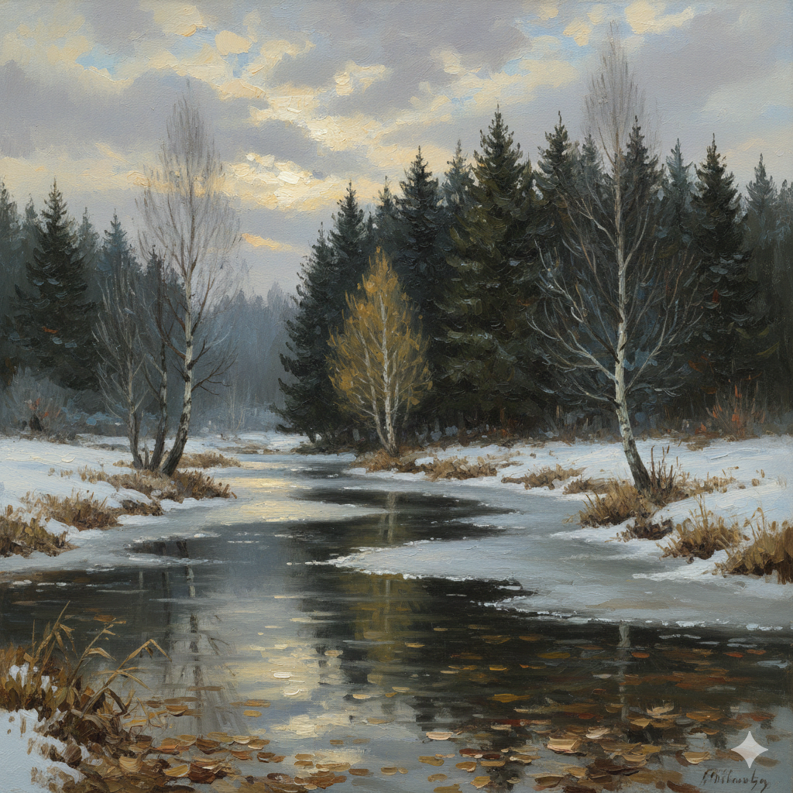
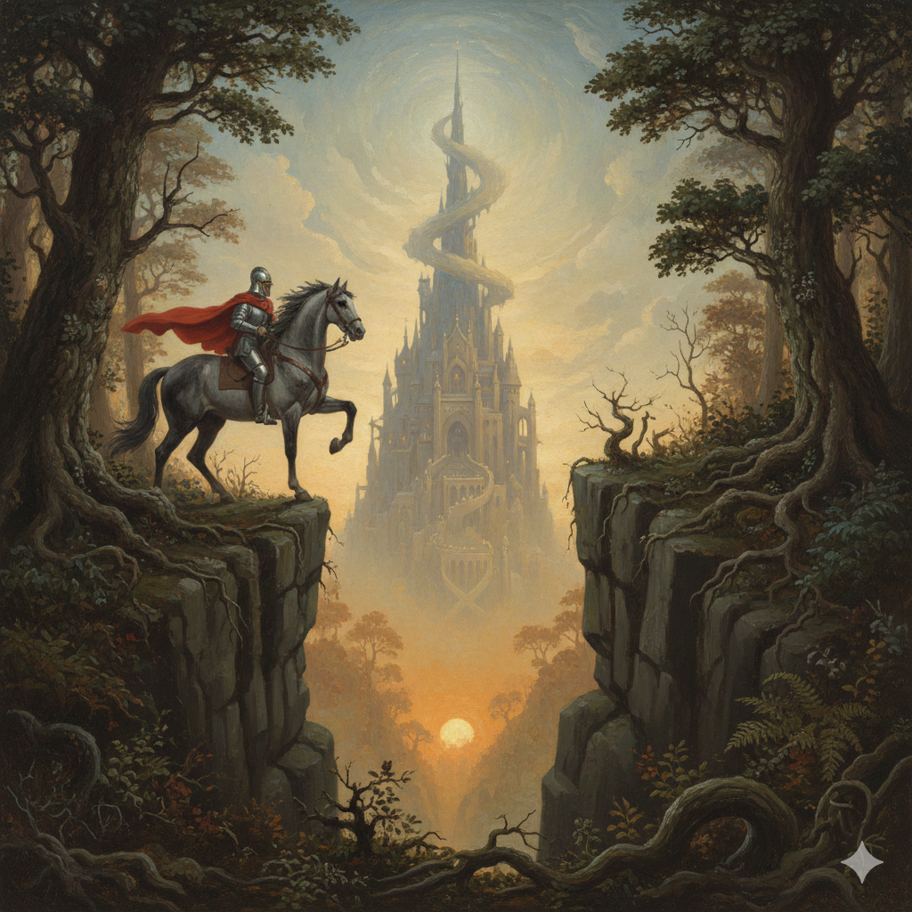

# Gemini AI Generated Images based on 

# *Chapter 46: The Castle of the Holy Grail*

## The Blasted Oak

A wintry brook occupied the main place in it. It was almost impossible to tell which way the brook was flowing. In fact, it was hardly flowing at all; a film
of ice was beginning to form on its surface. There were brownish tints in the shallows, reflected from fallen leaves covering the bottom. The first snow lay in patches on both banks, and the grass in between was brown and withered. Two willows grew by the brook, wraithlike and misty, wet from the powdery snow melting into them. But the most important part of the picture was the background: a dense rampart of olive-black firs with a single helpless birch gleaming in the front rank. Its gentle yellow glow made the host of sentinel conifers, with their sharp pikes raised skyward, look denser and darker still. The sky was a motley scrabble, and the setting sun was muffled by ragged cloud, which it was too weak to pierce with a direct ray. The focal point of the picture was not this either. It was the chill water of the standing brook. It had fullness and depth. It was leaden yet translucent, and it looked very cold. It seemed to hold the balance between autumn and winter.

## Moscow 1941

A girl in an anti-gas suit. Her head was thrown back, and she stared wildly at something hideous, something unforgivable before her. But this was no weak, girlish figure! Hands trained for battle gripped the sling of her gas mask. The dark gray anti-gas suit, with its stiff creases and silvery glint where the light caught its folds, looked like a suit of armor. Nobility, cruelty, and vengefulness had come together and were engraved on the face of this determined Komsomol from Kaluga, this far-from-beautiful girl in whom the artist had seen a Joan of Arc!
It showed something savage, uncontrollable. 

## The Castle of the Holy Grail

The picture was twice as high as it was wide. It showed a wedge-shaped crevice between two converging mountain precipices. On each of them, to the right and to the left, the trees on the fringe of a dense, primeval forest edged into the picture. Creeping bracken and ugly shrubs clung to the very edges and even the perpendicular walls of the two cliffs. High on the cliff to the left a light gray horse had emerged from the forest carrying a rider in a helmet and a scarlet cloak. The horse was not afraid of the abyss. Its hoof was raised ready, in obedience to the rider’s will, either to back away or to cross the abyss; it had the strength to leap as though winged. The rider himself had no eyes for the abyss before his horse. He was staring, in rapt amazement, into the depths of the picture, where an orange-gold radiance suffused the whole expanse of the sky above, emanating perhaps from the sun, perhaps from a still purer source concealed by the castle. Stepped and turreted, growing out of the stepped mountain and visible also from below through the cleft between the cliffs, between the trees and the ferns, rising to a needle point in mid-heaven at the top of the picture, hazy and indistinct, as if spun from shifting cloud, yet discernible in all the details of its unearthly perfection, ringed in a blue-gray aureole by the invisible super sun, stood the 
castle of the Holy Grail.

