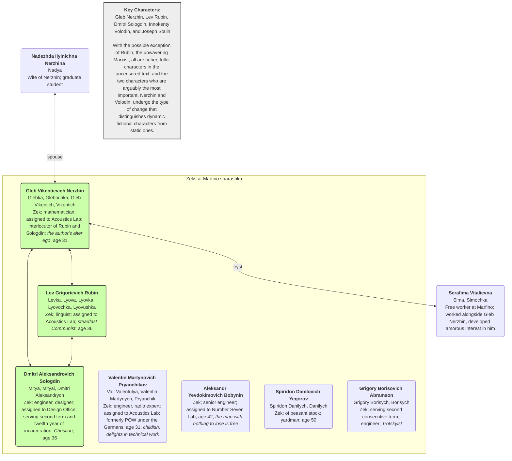
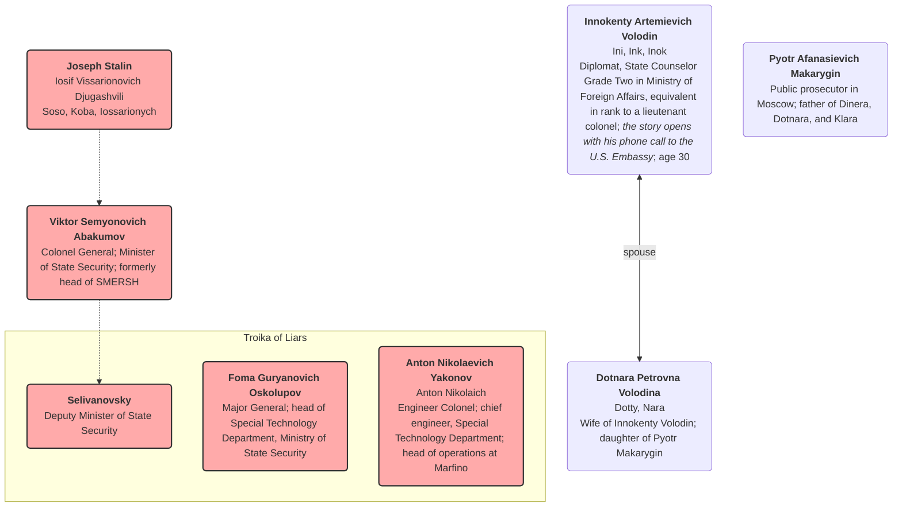

Last updated: 2025-08-02 Clicking on Abakumov or Stalin now takes you to their respective Wikipedia page

#  Aleksandr Solzhenitsyn, In the First Circle

## Overview (from Wikipedia)

***In the First Circle*** is a novel by Russian writer [Aleksandr Solzhenitsyn](https://en.wikipedia.org/wiki/Aleksandr_Solzhenitsyn), released in 1968. A more complete version of the book was published in English in 2009.

The novel depicts the lives of the occupants of a [sharashka](https://en.wikipedia.org/wiki/Sharashka) (a research and development bureau made of [Gulag](https://en.wikipedia.org/wiki/Gulag) inmates) located in the Moscow suburbs. This novel is highly autobiographical. Many of the prisoners ([zeks](https://en.wikipedia.org/wiki/Gulag#Terminology)) are technicians or academics who have been arrested under [Article 58](https://en.wikipedia.org/wiki/Article_58) of the [RSFSR](https://en.wikipedia.org/wiki/RSFSR) Penal Code in [Joseph Stalin](https://en.wikipedia.org/wiki/Joseph_Stalin)'s [purges](https://en.wikipedia.org/wiki/Joseph_Stalin#Purges_and_deportations) following the [Second World War](https://en.wikipedia.org/wiki/Second_World_War). Unlike inhabitants of other Gulag [labor camps](https://en.wikipedia.org/wiki/Labor_camp), the sharashka zeks were adequately fed and enjoyed good working conditions; however, if they found disfavor with the authorities, they could be instantly shipped to Siberia.

The title is an allusion to [Dante](https://en.wikipedia.org/wiki/Dante)'s [first circle](https://en.wikipedia.org/wiki/First_circle_of_hell), or [limbo](https://en.wikipedia.org/wiki/Limbo) of Hell in *[The Divine Comedy](https://en.wikipedia.org/wiki/The_Divine_Comedy)*, wherein the philosophers of Greece, and other [virtuous pagans](https://en.wikipedia.org/wiki/Virtuous_pagan), live in a walled green garden. They are unable to enter Heaven, as they were born before Christ, but enjoy a small space of relative freedom in the heart of Hell.

## Character Map

Source: [In the First Circle (Kindle)](https://read.amazon.com/?asin=B006IDG3Y0) > Cast of Characters

*Note: There are over 50 characters, so how to represent them and their relationships is a bit of a challenge*

### Marfino

### Soviet Leadership and Others

