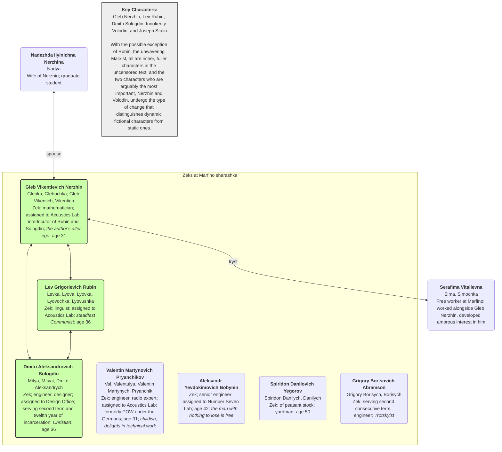
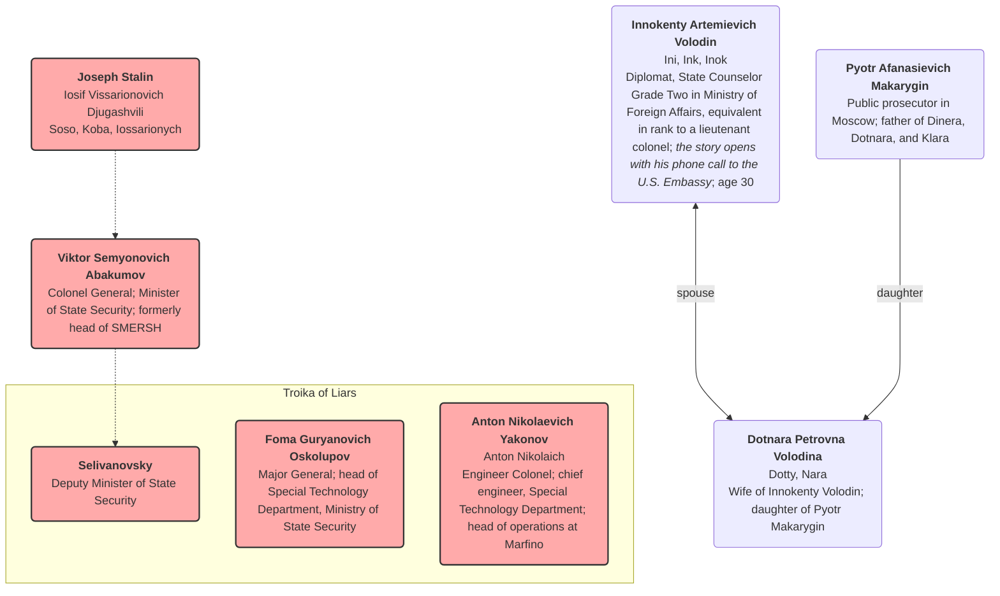

Last updated: 2025-09-06 added chapter summaries

#  Aleksandr Solzhenitsyn, In the First Circle

## Overview (from Wikipedia)

***In the First Circle*** is a novel by Russian writer [Aleksandr Solzhenitsyn](https://en.wikipedia.org/wiki/Aleksandr_Solzhenitsyn), released in 1968. A more complete version of the book was published in English in 2009.

The novel depicts the lives of the occupants of a [sharashka](https://en.wikipedia.org/wiki/Sharashka) (a research and development bureau made of [Gulag](https://en.wikipedia.org/wiki/Gulag) inmates) located in the Moscow suburbs. This novel is highly autobiographical. Many of the prisoners ([zeks](https://en.wikipedia.org/wiki/Gulag#Terminology)) are technicians or academics who have been arrested under [Article 58](https://en.wikipedia.org/wiki/Article_58) of the [RSFSR](https://en.wikipedia.org/wiki/RSFSR) Penal Code in [Joseph Stalin](https://en.wikipedia.org/wiki/Joseph_Stalin)'s [purges](https://en.wikipedia.org/wiki/Joseph_Stalin#Purges_and_deportations) following the [Second World War](https://en.wikipedia.org/wiki/Second_World_War). Unlike inhabitants of other Gulag [labor camps](https://en.wikipedia.org/wiki/Labor_camp), the sharashka zeks were adequately fed and enjoyed good working conditions; however, if they found disfavor with the authorities, they could be instantly shipped to Siberia.

The title is an allusion to [Dante](https://en.wikipedia.org/wiki/Dante)'s [first circle](https://en.wikipedia.org/wiki/First_circle_of_hell), or [limbo](https://en.wikipedia.org/wiki/Limbo) of Hell in *[The Divine Comedy](https://en.wikipedia.org/wiki/The_Divine_Comedy)*, wherein the philosophers of Greece, and other [virtuous pagans](https://en.wikipedia.org/wiki/Virtuous_pagan), live in a walled green garden. They are unable to enter Heaven, as they were born before Christ, but enjoy a small space of relative freedom in the heart of Hell.

## Character Map

Source: [In the First Circle (Kindle)](https://read.amazon.com/?asin=B006IDG3Y0) > Cast of Characters

*Note: There are over 50 characters, so how to represent them and their relationships is a bit of a challenge*

### Marfino

Add the Junior Lt and Lt. Colonel

### Soviet Leadership and Others

Add the girl Yakonov was engaged to: Agnia 

## Chapter Summaries
### Chapter 1 - Torpedo
### Chapter 2 - A Miscue
### Chapter 3 - Sharashka
### Chapter 4 - A Protestant Christmas
### Chapter 5 - Boogie-Woogie
### Chapter 6 - A Peaceful Existence
### Chapter 7 - A Woman’s Heart
### Chapter 8 - “Oh, Moment, Stay!”
### Chapter 9 - The Fifth Year in Harness
### Chapter 10 - The Rosicrucians
### Chapter 11 - The Enchanted Castle
### Chapter 12 - Number Seven
### Chapter 13 - He Should Have Lied
### Chapter 14 - The Blue Light
### Chapter 15 - A Girl! A Girl!
### Chapter 16 - A Troika of Liars
### Chapter 17 - Hot Water
### Chapter 18 - “Oh, Wonder-Working Steed”
### Chapter 19 - The Birthday Hero
### Chapter 20 - A Study of a Great Life

Characters: Joseph **Stalin** 

* L-O-N-G!
* Stalin's view of events through his rise to power

### Chapter 21 - Give Us Back the Death Penalty!

Characters: **Abakumov** and **Stalin**

* After a long wait, **Abakumov** makes his monthly report to **Stalin**
* They touch on many subjects, but *not* the scrambler telephone
* "When you deserve it, that’s when we’ll shoot you."
* Abakumov leaves greatly relieved; has another month to breathe

### Chapter 22 - The Emperor of the Earth

Characters: Joseph **Stalin** 

The entire chapter is Stalin's deeply insecure and paranoid inner monologue as he contemplates his power, legacy, and mortality.

- **A Delusion of Grandeur:** Stalin paces his study, filled with a sense of self-importance and accompanied by the "music" of an imagined brass band. He believes he must live to old age to complete his work, which includes winning the "last world war" and building "true Communism."
- **The Nature of Communism:** He redefines Communism not as a society of plenty, but as a system of total discipline and subordination, where people have only "modest plenty." He fears that prosperity would lead to ideological deviation and believes he has already built this version of Communism.
- **A Return to the Old Ways:** Driven by a desire for greater authority and stability, Stalin increasingly incorporates elements of old-world Russian traditions and symbols into his regime. He reinstates concepts like the "motherland" and "officer corps" and is drawn to the idea of an "emperor," even enjoying wearing a tsarist-style uniform. He also secretly takes comfort in his religious upbringing and his mother's wish that he had become a priest, making a secret vow to God during the war.
- **Isolation and Dread:** Despite his immense power, he feels completely isolated. He is surrounded by people he cannot trust and is tormented by the ghosts of his executed rivals, whose books he keeps in his study as a way to "sharpen his temper."
- **Fear of Mortality:** His greatest fear is not of a political rival, but of his own aging body and mind. He feels his memory failing and his strength ebbing, leading him to take stimulants. The text ends with him, exhausted and alone, accepting that he can never rest, as his country depends entirely on his constant vigilance.

### Chapter 23 - Language as an Instrument of Production

Characters: Joseph Stalin 

An intimate, and unsettling, look into the mind of a lonely and paranoid **Stalin**, as he grapples with his legacy and his place in history.

- **A Quest for Immortality:** Stalin is dissatisfied with the praise he receives and feels compelled to make a significant, immortal contribution to a field beyond politics, specifically in science or academia. He considers physics or mathematics, but finds them too difficult.
- **Finding a New Field:** A theory by a Georgian philologist named Chikobava provides the perfect opportunity. Chikobava's ideas challenge the official Marxist view that language is merely a "superstructure" of the economy. This seemingly heretical idea captures Stalin's interest because it presents a "third possibility" outside of strict Marxist dialectics.
- **The Dictator as Academic:** Stalin decides to appropriate and "perfect" Chikobava's theory, refuting the existing academic consensus to establish his own brilliance. He muses on how to phrase his argument to make it sound both sophisticated and ideologically correct, even when the logic is flawed.
- **Loneliness and Paranoia:** Stalin lives in a heavily guarded fortress, isolated from the outside world. He believes the entire country he rules is a "figment" that only exists to provide him with resources, and he fears public appearances where he feels awkward and vulnerable.
- **Redefining Revolution:** While writing, Stalin's thoughts turn to the nature of revolution. He reinterprets Marxist theory to declare that "revolutions from above" (like his own forced collectivization) are valid and that the time for "explosions" is over. He intends to present this as an ideological shift that will prevent any future revolutions.
- **A New War:** His thoughts transition from philology to his plans for global conquest. He dreams of a third world war, believing a swift military blitzkrieg is the simplest way to establish communism across the globe, without the messiness of more revolutions. The text concludes with him falling asleep, plotting global domination.

### Chapter 24 - The Abyss Beckons Again

Characters: Colonel Anton Nikolaevich **Yakonov** and his driver

Yakonov is on a journey of despair and memory, revealing his inner turmoil and the political dangers he faces.

- **A Sudden Collapse:** The story opens with Yakonov, a high-ranking official, leaving his ministry late at night, in a state of deep shock and disorientation. His normally composed demeanor is gone, replaced by trembling and a dazed stare.
- **A Journey into the Night:** He tells his driver to go, choosing to wander the empty, frozen streets of Moscow on foot. This solitary walk is a "one-man funeral procession," a physical manifestation of his internal turmoil and sense of impending doom.
- **The Weight of Fear:** Yakonov's despair is triggered by a terrifying encounter at the ministry. He was brutally confronted by a powerful minister, **Abakumov**, who demoted his colleagues and sent one to prison. Yakonov himself was sentenced to a lesser punishment—working on a difficult, possibly sabotaged project—but the threat of a return to his past as a convict hangs over him.
- **A Cycle of Fear:** The text reveals that Yakonov was a former prisoner, sent to a special scientific prison camp (another sharashka) during the Soviet purges. He has tried desperately to hide this past, avoiding anyone who reminds him of it. The new political climate and the minister's threats have revived his deepest fears.
- **A Final Destination:** His aimless walk eventually leads him to a ruined church and its surrounding steps. He recognizes the location from over two decades ago, a place he visited with a woman named Agnia. The memory, and the ruined state of the church, brings the story full circle.

### Chapter 25 - The Church of Nikita the Martyr

Characters: **Agnia** and Colonel Anton Nikolaevich **Yakonov**

* **Agnia** is a unique and sensitive woman who is emotionally fragile but has a deep appreciation for nature and art, believing in the purity of faith and art. She is described as being from "some other world."

* **Yakonov**, a brilliant and seemingly practical man, is drawn to her, despite their very different outlooks on life. He is a man of his time, more focused on logic and the new political ideology.

- Agnia is uncomfortable with physical intimacy, even with Yakonov, and finds the idea of marriage overwhelming. She agrees to marry him only after he promises that their union will be primarily a spiritual one.
- Agnia's unconventional beliefs are revealed when she takes Yakonov to a specific Moscow church, the Church of Nikita the Martyr, which she considers a "loveliest place." She believes it will be demolished because it's being "persecuted" by the new regime.
- Their differing worldviews are highlighted in their argument about the church. Yakonov argues from a historical and political perspective, while Agnia feels an emotional and spiritual connection to it, believing it is being oppressed.
- The relationship ends after Yakonov returns from a trip abroad and writes a propaganda article. ***Agnia sends his ring back with a note referencing a historical figure, Metropolitan Cyril, who made a deal with the Tatars, subtly accusing Yakonov of betraying his principles for personal gain.***
- Years later, Yakonov is a successful man with a family and career but returns to the now-ruined church. Standing among the rubble, he feels empty and hopeless, realizing that the new way of life has cost him his soul and the "music" that Agnia had warned him about.

### Chapter 26 - Sawing Wood

Characters: **Gleb Nerzhin**, **Dmitri Sologdin**, **Spiridon**

* my favorite chapter in this section 
* several nods to Dostoevsky (Karamazov, Demons/The Possessed)
* great conversation between **Sologdin** (Christian) and **Nerzhin** (agnostic)
* Sologdin "in his soul there was a peace that nothing could destroy."
* "Each man believed himself superior to the other: Sologdin because he knew all about mechanics, the resistance of metals, and other scientific matters, and also because of his broad grasp of social issues; **Spiridon** because material objects always obeyed him."
* The therapeutic effect of uncoerced physical work
* "They who want to destroy Christianity, and only they, would have it become the creed of eunuchs. But Christianity is the faith of the strong in spirit. We must have the courage to see the evil in the world and to root it out. Wait a while—you, too, will come to God. Your refusal to believe in anything is no position for a thinking man; it’s just spiritual poverty."

### Chapter 27 - A Bit of Methodology

Characters: **Gleb Nerzhin**, **Dmitri Sologdin**, Nadelashin

A continuation of the previous chapter: Nerzhin and Sologdin take a break from sawing wood and discuss their personal philosophies.

- Sologdin, a mathematician, shares two of his "rules" for life and work with Nerzhin: 
  - how to view difficulties as a "hidden treasure" 
  - the importance of completing a project's "final inches" to ensure perfection.
- The men's conversation is interrupted by an officer, Nadelashin, who brings them an ax and asks them to chop the wood.
- The conversation shifts to the topic of prison visits, and the two men express their bitterness and envy toward other prisoners who are allowed to see their families.
- Nerzhin is called to the headquarters, and it is revealed that he has been granted a visit with his wife for his birthday. Sologdin is left to chop wood alone, and in his rage, he splits a log and drives the ax into the ground.

### Chapter 28 - The Junior Lieutenant’s Job

Characters: **Nadelashin**, **Myshin**

- Junior Lieutenant **Nadelashin** is an unusually kindhearted and honest prison guard who is on duty for 12-hour shifts. He is unique among his peers for not drinking alcohol or using profanity.
- He is on duty one night and is repeatedly summoned by his superior, Major **Myshin**, who is a harsh, resentful man. Myshin has Nadelashin investigate prisoners celebrating Christmas and gather incriminating information on a prisoner named **Rubin**, whom Myshin hates.
- Later that night, a sentry in a watchtower reports a potential escape attempt. Nadelashin must organize a sweep of the prison yard and then count all the sleeping prisoners.
- The narrator reveals more about Nadelashin's background: he comes from a family of tailors but was forced to join the prison guard service. He secretly continues to sew for his family, a detail he keeps hidden because it would be considered demeaning for a member of the armed forces.

### Chapter 29 - The Lieutenant Colonel’s Job

Characters: Lieutenant Colonel **Klimentiev**, **Nadya** (Nerzhin's wife), Junior Lieutenant **Nadelashin**, **Gleb Nerzhin**

- Lieutenant Colonel **Klimentiev**, the commandant of a special prison, is a somber and strict officer who values military discipline. He arrives at work on a Sunday and summons Junior Lieutenant **Nadelashin** and prisoner **Gleb Nerzhin** to his office.
- While reviewing Nadelashin's report, Klimentiev admonishes him for his leniency and lack of discipline, warning him that such behavior could lead to a prisoner mutiny. He then gives Nadelashin instructions for the day and sends him away.
- Klimentiev decides to grant Nerzhin permission to see his wife, recalling a recent encounter with her on the metro. Klimentiev had initially planned to follow protocol and deny the visit, but her desperate plea and a flash of empathy cause him to break from regulations and tell her to come to the prison the next day.
- Nerzhin is called in and, to his surprise, is informed of the visit. He reacts with uncharacteristic joy and thanks Klimentiev, who remains impassive. Klimentiev then briefs the guards for the visit, reminding them that the prisoners are "inveterate criminals" who may try to pass state secrets to their wives.
