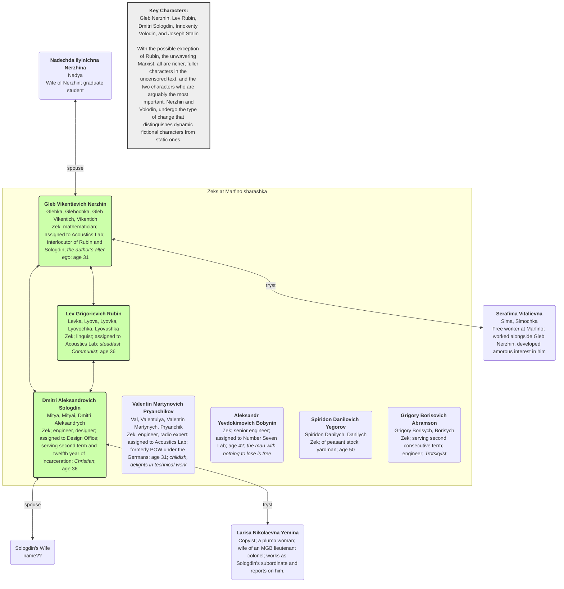
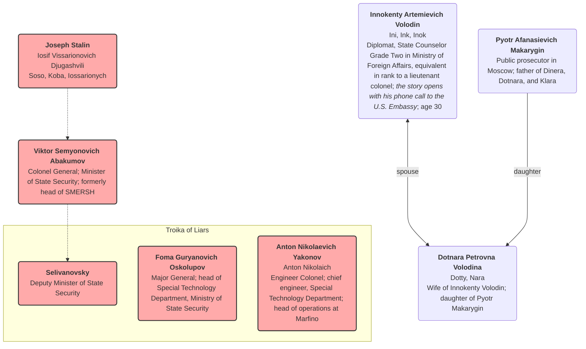

Last updated: 2025-12-01 added more chapter summaries

#  Aleksandr Solzhenitsyn, In the First Circle

[TOC]

## Overview (from Wikipedia)

***In the First Circle*** is a novel by Russian writer [Aleksandr Solzhenitsyn](https://en.wikipedia.org/wiki/Aleksandr_Solzhenitsyn), released in 1968. A more complete version of the book was published in English in 2009.

The novel depicts the lives of the occupants of a [sharashka](https://en.wikipedia.org/wiki/Sharashka) (a research and development bureau made of [Gulag](https://en.wikipedia.org/wiki/Gulag) inmates) located in the Moscow suburbs. This novel is highly autobiographical. Many of the prisoners ([zeks](https://en.wikipedia.org/wiki/Gulag#Terminology)) are technicians or academics who have been arrested under [Article 58](https://en.wikipedia.org/wiki/Article_58) of the [RSFSR](https://en.wikipedia.org/wiki/RSFSR) Penal Code in [Joseph Stalin](https://en.wikipedia.org/wiki/Joseph_Stalin)'s [purges](https://en.wikipedia.org/wiki/Joseph_Stalin#Purges_and_deportations) following the [Second World War](https://en.wikipedia.org/wiki/Second_World_War). Unlike inhabitants of other Gulag [labor camps](https://en.wikipedia.org/wiki/Labor_camp), the sharashka zeks were adequately fed and enjoyed good working conditions; however, if they found disfavor with the authorities, they could be instantly shipped to Siberia.

The title is an allusion to [Dante](https://en.wikipedia.org/wiki/Dante)'s [first circle](https://en.wikipedia.org/wiki/First_circle_of_hell), or [limbo](https://en.wikipedia.org/wiki/Limbo) of Hell in *[The Divine Comedy](https://en.wikipedia.org/wiki/The_Divine_Comedy)*, wherein the philosophers of Greece, and other [virtuous pagans](https://en.wikipedia.org/wiki/Virtuous_pagan), live in a walled green garden. They are unable to enter Heaven, as they were born before Christ, but enjoy a small space of relative freedom in the heart of Hell.

## Character Map (work in progress)

Source: [In the First Circle (Kindle)](https://read.amazon.com/?asin=B006IDG3Y0) > Cast of Characters

*Note: There are over 50 characters, so how to represent them and their relationships is a bit of a challenge*

### Marfino

Add the Junior Lt and Lt. Colonel

What is Sologdon's wife's name?

Rubin has a wife and a mistress.  Both write to him.

### Soviet Leadership and Others

Add the girl Yakonov was engaged to: Agnia 

## Chapter Summaries: 1-20

### Chapter 1 - Torpedo
### Chapter 2 - A Miscue
### Chapter 3 - Sharashka
### Chapter 4 - A Protestant Christmas
### Chapter 5 - Boogie-Woogie
### Chapter 6 - A Peaceful Existence
### Chapter 7 - A Woman’s Heart
### Chapter 8 - “Oh, Moment, Stay!”
### Chapter 9 - The Fifth Year in Harness
### Chapter 10 - The Rosicrucians
### Chapter 11 - The Enchanted Castle
### Chapter 12 - Number Seven
### Chapter 13 - He Should Have Lied
### Chapter 14 - The Blue Light
### Chapter 15 - A Girl! A Girl!
### Chapter 16 - A Troika of Liars
### Chapter 17 - Hot Water
### Chapter 18 - “Oh, Wonder-Working Steed”
### Chapter 19 - The Birthday Hero
### Chapter 20 - A Study of a Great Life

Characters: Joseph **Stalin** 

* L-O-N-G!
* Stalin's view of events through his rise to power

## Chapter Summaries: 21-40

### Chapter 21 - Give Us Back the Death Penalty!

Characters: **Abakumov** and **Stalin**

* After a long wait, **Abakumov** makes his monthly report to **Stalin**
* They touch on many subjects, but *not* the scrambler telephone
* "When you deserve it, that’s when we’ll shoot you."
* Abakumov leaves greatly relieved; has another month to breathe

### Chapter 22 - The Emperor of the Earth

Characters: Joseph **Stalin** 

The entire chapter is Stalin's deeply insecure and paranoid inner monologue as he contemplates his power, legacy, and mortality.

- **A Delusion of Grandeur:** Stalin paces his study, filled with a sense of self-importance and accompanied by the "music" of an imagined brass band. He believes he must live to old age to complete his work, which includes winning the "last world war" and building "true Communism."
- **The Nature of Communism:** He redefines Communism not as a society of plenty, but as a system of total discipline and subordination, where people have only "modest plenty." He fears that prosperity would lead to ideological deviation and believes he has already built this version of Communism.
- **A Return to the Old Ways:** Driven by a desire for greater authority and stability, Stalin increasingly incorporates elements of old-world Russian traditions and symbols into his regime. He reinstates concepts like the "motherland" and "officer corps" and is drawn to the idea of an "emperor," even enjoying wearing a tsarist-style uniform. He also secretly takes comfort in his religious upbringing and his mother's wish that he had become a priest, making a secret vow to God during the war.
- **Isolation and Dread:** Despite his immense power, he feels completely isolated. He is surrounded by people he cannot trust and is tormented by the ghosts of his executed rivals, whose books he keeps in his study as a way to "sharpen his temper."
- **Fear of Mortality:** His greatest fear is not of a political rival, but of his own aging body and mind. He feels his memory failing and his strength ebbing, leading him to take stimulants. The text ends with him, exhausted and alone, accepting that he can never rest, as his country depends entirely on his constant vigilance.

### Chapter 23 - Language as an Instrument of Production

Characters: Joseph Stalin 

An intimate, and unsettling, look into the mind of a lonely and paranoid **Stalin**, as he grapples with his legacy and his place in history.

- **A Quest for Immortality:** Stalin is dissatisfied with the praise he receives and feels compelled to make a significant, immortal contribution to a field beyond politics, specifically in science or academia. He considers physics or mathematics, but finds them too difficult.
- **Finding a New Field:** A theory by a Georgian philologist named Chikobava provides the perfect opportunity. Chikobava's ideas challenge the official Marxist view that language is merely a "superstructure" of the economy. This seemingly heretical idea captures Stalin's interest because it presents a "third possibility" outside of strict Marxist dialectics.
- **The Dictator as Academic:** Stalin decides to appropriate and "perfect" Chikobava's theory, refuting the existing academic consensus to establish his own brilliance. He muses on how to phrase his argument to make it sound both sophisticated and ideologically correct, even when the logic is flawed.
- **Loneliness and Paranoia:** Stalin lives in a heavily guarded fortress, isolated from the outside world. He believes the entire country he rules is a "figment" that only exists to provide him with resources, and he fears public appearances where he feels awkward and vulnerable.
- **Redefining Revolution:** While writing, Stalin's thoughts turn to the nature of revolution. He reinterprets Marxist theory to declare that "revolutions from above" (like his own forced collectivization) are valid and that the time for "explosions" is over. He intends to present this as an ideological shift that will prevent any future revolutions.
- **A New War:** His thoughts transition from philology to his plans for global conquest. He dreams of a third world war, believing a swift military blitzkrieg is the simplest way to establish communism across the globe, without the messiness of more revolutions. The text concludes with him falling asleep, plotting global domination.

### Chapter 24 - The Abyss Beckons Again

Characters: Colonel Anton Nikolaevich **Yakonov** and his driver

Yakonov is on a journey of despair and memory, revealing his inner turmoil and the political dangers he faces.

- **A Sudden Collapse:** The story opens with Yakonov, a high-ranking official, leaving his ministry late at night, in a state of deep shock and disorientation. His normally composed demeanor is gone, replaced by trembling and a dazed stare.
- **A Journey into the Night:** He tells his driver to go, choosing to wander the empty, frozen streets of Moscow on foot. This solitary walk is a "one-man funeral procession," a physical manifestation of his internal turmoil and sense of impending doom.
- **The Weight of Fear:** Yakonov's despair is triggered by a terrifying encounter at the ministry. He was brutally confronted by a powerful minister, **Abakumov**, who demoted his colleagues and sent one to prison. Yakonov himself was sentenced to a lesser punishment—working on a difficult, possibly sabotaged project—but the threat of a return to his past as a convict hangs over him.
- **A Cycle of Fear:** The text reveals that Yakonov was a former prisoner, sent to a special scientific prison camp (another sharashka) during the Soviet purges. He has tried desperately to hide this past, avoiding anyone who reminds him of it. The new political climate and the minister's threats have revived his deepest fears.
- **A Final Destination:** His aimless walk eventually leads him to a ruined church and its surrounding steps. He recognizes the location from over two decades ago, a place he visited with a woman named Agnia. The memory, and the ruined state of the church, brings the story full circle.

### Chapter 25 - The Church of Nikita the Martyr

Characters: **Agnia** and Colonel Anton Nikolaevich **Yakonov**

* **Agnia** is a unique and sensitive woman who is emotionally fragile but has a deep appreciation for nature and art, believing in the purity of faith and art. She is described as being from "some other world."

* **Yakonov**, a brilliant and seemingly practical man, is drawn to her, despite their very different outlooks on life. He is a man of his time, more focused on logic and the new political ideology.

- Agnia is uncomfortable with physical intimacy, even with Yakonov, and finds the idea of marriage overwhelming. She agrees to marry him only after he promises that their union will be primarily a spiritual one.
- Agnia's unconventional beliefs are revealed when she takes Yakonov to a specific Moscow church, the Church of Nikita the Martyr, which she considers a "loveliest place." She believes it will be demolished because it's being "persecuted" by the new regime.
- Their differing worldviews are highlighted in their argument about the church. Yakonov argues from a historical and political perspective, while Agnia feels an emotional and spiritual connection to it, believing it is being oppressed.
- The relationship ends after Yakonov returns from a trip abroad and writes a propaganda article. ***Agnia sends his ring back with a note referencing a historical figure, Metropolitan Cyril, who made a deal with the Tatars, subtly accusing Yakonov of betraying his principles for personal gain.***
- Years later, Yakonov is a successful man with a family and career but returns to the now-ruined church. Standing among the rubble, he feels empty and hopeless, realizing that the new way of life has cost him his soul and the "music" that Agnia had warned him about.

### Chapter 26 - Sawing Wood

Characters: **Gleb Nerzhin**, **Dmitri Sologdin**, **Spiridon**

* my favorite chapter in this section 
* several nods to Dostoevsky (Karamazov, Demons/The Possessed)
* great conversation between **Sologdin** (Christian) and **Nerzhin** (agnostic)
* Sologdin "in his soul there was a peace that nothing could destroy."
* "Each man believed himself superior to the other: Sologdin because he knew all about mechanics, the resistance of metals, and other scientific matters, and also because of his broad grasp of social issues; **Spiridon** because material objects always obeyed him."
* The therapeutic effect of uncoerced physical work
* "They who want to destroy Christianity, and only they, would have it become the creed of eunuchs. But Christianity is the faith of the strong in spirit. We must have the courage to see the evil in the world and to root it out. Wait a while—you, too, will come to God. Your refusal to believe in anything is no position for a thinking man; it’s just spiritual poverty."

### Chapter 27 - A Bit of Methodology

Characters: **Gleb Nerzhin**, **Dmitri Sologdin**, Nadelashin

A continuation of the previous chapter: Nerzhin and Sologdin take a break from sawing wood and discuss their personal philosophies.

- Sologdin, a mathematician, shares two of his "rules" for life and work with Nerzhin: 
  - how to view difficulties as a "hidden treasure" 
  - the importance of completing a project's "final inches" to ensure perfection.
- The men's conversation is interrupted by an officer, Nadelashin, who brings them an ax and asks them to chop the wood.
- The conversation shifts to the topic of prison visits, and the two men express their bitterness and envy toward other prisoners who are allowed to see their families.
- Nerzhin is called to the headquarters, and it is revealed that he has been granted a visit with his wife for his birthday. Sologdin is left to chop wood alone, and in his rage, he splits a log and drives the ax into the ground.

### Chapter 28 - The Junior Lieutenant’s Job

Characters: **Nadelashin**, **Myshin**

- Junior Lieutenant **Nadelashin** is an unusually kindhearted and honest prison guard who is on duty for 12-hour shifts. He is unique among his peers for not drinking alcohol or using profanity.
- He is on duty one night and is repeatedly summoned by his superior, Major **Myshin**, who is a harsh, resentful man. Myshin has Nadelashin investigate prisoners celebrating Christmas and gather incriminating information on a prisoner named **Rubin**, whom Myshin hates.
- Later that night, a sentry in a watchtower reports a potential escape attempt. Nadelashin must organize a sweep of the prison yard and then count all the sleeping prisoners.
- The narrator reveals more about Nadelashin's background: he comes from a family of tailors but was forced to join the prison guard service. He secretly continues to sew for his family, a detail he keeps hidden because it would be considered demeaning for a member of the armed forces.

### Chapter 29 - The Lieutenant Colonel’s Job

Characters: Lieutenant Colonel **Klimentiev**, **Nadya** (Nerzhin's wife), Junior Lieutenant **Nadelashin**, **Gleb Nerzhin**

- Lieutenant Colonel **Klimentiev**, the commandant of a special prison, is a somber and strict officer who values military discipline. He arrives at work on a Sunday and summons Junior Lieutenant **Nadelashin** and prisoner **Gleb Nerzhin** to his office.
- While reviewing Nadelashin's report, Klimentiev admonishes him for his leniency and lack of discipline, warning him that such behavior could lead to a prisoner mutiny. He then gives Nadelashin instructions for the day and sends him away.
- Klimentiev decides to grant Nerzhin permission to see his wife, recalling a recent encounter with her on the metro. Klimentiev had initially planned to follow protocol and deny the visit, but her desperate plea and a flash of empathy cause him to break from regulations and tell her to come to the prison the next day.
- Nerzhin is called in and, to his surprise, is informed of the visit. He reacts with uncharacteristic joy and thanks Klimentiev, who remains impassive. Klimentiev then briefs the guards for the visit, reminding them that the prisoners are "inveterate criminals" who may try to pass state secrets to their wives.

### Chapter 30 A Puzzled Robot

Nerzhin's despair turns to elation and purpose upon learning his wife will visit him today, making his difficult life suddenly meaningful. The chapter also introduces Andrei Potapov, a meticulous and work-obsessed engineer, whose past is detailed, including his wartime capture, his steadfast refusal to collaborate with Germans, and his perplexing imprisonment.

#### Characters

*   **Nerzhin (Gleb):** A prisoner whose outlook on life dramatically brightens upon hearing his wife will visit him.
*   **Junior Lieutenant Nadelashin:** An officer in the hallway whom Nerzhin almost bowls over in his rush.
*   **Valentulya:** A fellow prisoner who entertains others with a story and is then comically "tortured" for not speaking up for prisoners.
*   **Andrei Andreevich Potapov:** A meticulous, work-focused engineer, nicknamed "robot," serving a sentence for allegedly betraying secrets of the Dnieper Hydroelectric Station.
*   **Katya:** Potapov's wife, who supported his decision to go to war.
*   **Unknown Russian:** A polite but manipulative interrogator in Berlin who offered Potapov freedom for collaboration.
*   **Engineer Markushev:** Another engineer who did sign an undertaking to work for the Germans and received the same ten-year sentence as Potapov.
*   **Count Esterhazy:** Potapov's former cellmate in Lubyanka.

#### Summary

*   Nerzhin rushes back to his quarters, filled with sudden joy and a sense of life's purpose after learning his wife will visit him that day.
*   Valentulya tells a story to fellow prisoners but is then playfully "tortured" with belts and hot tea for his perceived failure to advocate for prisoners' needs.
*   Andrei Potapov is introduced, a precise engineer meticulously eating his breakfast, known for his singular focus on work.
*   Potapov's past is recounted: he was arrested and sentenced for "betraying the secret of the Dnieper Hydroelectric Station" by drawing an already published diagram for the Germans while a prisoner of war.
*   During his captivity, Potapov politely refused an offer from an "unknown Russian" to be released and work for the Germans, stating his loyalty to his original oath.
*   Nerzhin finds a handcrafted cigarette case with a poetic inscription on his bunk, realizing it's a birthday gift from Potapov, who jokingly denies making it.
*   Potapov, a man who previously eschewed politics, reflects on his experiences and for the first time questions the fundamental purpose of the Dnieper Power Station.

### Chapter 31 How to Darn Socks

This chapter details a Sunday morning routine in a special prison (sharashka), contrasting the orderly officers' inspections with the prisoners' differing attitudes toward work, leisure, and reading material. It highlights discussions about a New Year's party, defiance against prison rules, and coping mechanisms in a confined environment.

#### Characters

*   **Senior Lieutenant Shusterman:** A tall, unfeeling orderly officer from Lubyanka, tasked with stiffening discipline.
*   **Nadelashin:** Another orderly officer, polite but strict, who announces visitor times.
*   **Khorobrov:** A defiant prisoner who voices discontent and prefers staying in bed on Sunday over "voluntary" work.
*   **Dvoetyosov:** A large, unkempt prisoner who loudly inquires about a New Year's party.
*   **Ruska:** A cheerful prisoner, preparing for a visitor, who asks about making toys for the party.
*   **Abramson (Grigory Borisych):** An older, experienced prisoner who prioritizes rest and provides commentary on prisoner life and literature.
*   **Rubin (Lev):** A disheveled prisoner who offers a philosophical birthday wish to Nerzhin.
*   **Nerzhin (Gleb):** A prisoner preparing for his wife's visit, contemplating his future sentence, and struggling with borrowed attire.
*   **Designer:** A timid, balding prisoner who stays behind to darn socks on his authorized day off.
*   **Berkalov:** An artillery officer whose story is told, illustrating unpredictable fate as he won a Stalin Prize while imprisoned.

#### Summary

*   Orderly officers conduct rounds, announcing visitor times and a New Year's party but no film, leading to comments from Khorobrov and general discussion among prisoners.
*   Khorobrov and Abramson engage in a debate about prisoner conduct, with Khorobrov advocating defiance and Abramson advising caution and conservation of energy.
*   Rubin delivers a philosophical birthday wish to Nerzhin, who is pre-occupied with his impending wife's visit and the prospect of extended exile.
*   Many prisoners leave for Sunday work, while Khorobrov, Abramson, Nerzhin, and a designer remain, each engaging in their own forms of leisure or task.
*   Khorobrov, finding all official reading material sickeningly false, discovers Abramson's hidden copy of "The Count of Monte Cristo" and eagerly arranges to borrow it.
*   Abramson provides detailed instructions on darning socks to the designer, interweaving his advice with the anecdotal story of General Berkalov's simultaneous imprisonment and Stalin Prize award.

### Chapter 32 On the Path to a Million

This chapter introduces Professor Chelnov, an esteemed and eccentric zek mathematician, and details his evaluation of Sologdin's innovative Scrambler design. It explores Sologdin's personal history, his struggle with the ethical implications of creating technology for his captors, and Chelnov's pragmatic perspective on their situation.

#### Characters

*   **Professor Chelnov:** An esteemed mathematician and eccentric zek, trusted to move between sharashkas to solve urgent mathematical problems.
*   **Sologdin:** A zek designer who has developed a promising scrambler, grappling with the moral implications of his work for the regime.
*   **Lev Rubin:** A zek who discussed a poem about Moses with Chelnov, highlighting their shared predicament.
*   **Major Shikin:** The institute's security officer, perpetually anxious about Chelnov's unsecured room.
*   **Maria Ivanovna:** A cleaning woman working at the Top-Secret Department's checkpoint.

#### Summary

*   Professor Chelnov, an itinerant zek mathematician, arrives at Marfino to work on a Scrambler and is granted unusual privileges, including a key to his own room.
*   Sologdin, having secretly developed a promising Scrambler design, brings it to Chelnov for an unofficial opinion.
*   Chelnov recounts a conversation with Lev Rubin, where they discussed Rubin's poem about Moses leading the Jews through the wilderness, humorously dissecting its geographical and human aspects.
*   Chelnov provides his expert verdict on Sologdin's design, confirming its theoretical feasibility but suggesting crucial improvements, such as making it insensitive to low-energy impulses and ensuring random sequence changes.
*   Chelnov informs Sologdin that his excellent design is likely to lead to his release, the quashing of his conviction, and potentially a Stalin Prize.
*   Sologdin expresses moral reservations about his work, questioning the ethics of creating advanced technology for "the very people who put us inside."
*   Chelnov reveals that another designer, Anton Nikolaevich, has already seen Sologdin's drawing, which Sologdin initially wanted to keep private.

### Chapter 33 Penalty Marks

An engineer-prisoner, Sologdin, finds himself alone with a copyist, Larisa Nikolaevna, in the design office on a Sunday off. Their conversation delves into his strict personal code, his harrowing past in the camps, and the complex, supervised nature of their relationship.

#### Characters

*   **Sologdin (Dmitri Aleksandrovich):** An engineer-prisoner with an intellectual, austere demeanor, meticulous about his work and personal conduct.
*   **Larisa Nikolaevna Yemina:** A plump, placid copyist, wife of an MGB lieutenant colonel, who works as Sologdin's subordinate and reports on him.
*   **Major Shikinidi (Shikin):** The head of the design office, who assigned Larisa to spy on Sologdin.
*   **Lieutenant Kamyshan:** An interrogator from Sologdin's past in the camps, known for his brutality.
*   **Sologdin's wife:** His wife, to whom he writes carefully crafted letters to maintain their connection during his long imprisonment.

#### Summary

*   Sologdin enters the design office expecting a crowd but finds only Larisa Nikolaevna, learning the office has been given a day off for Sunday.
*   He expresses anger and sarcasm about the perceived lack of "urgent work," threatening to make the absent comrades work day and night.
*   Sologdin explains his use of "foot rags" instead of socks due to his meager engineer's salary, contrasting it with Larisa's higher pay.
*   He recounts his harrowing past in prison camps, including torture and near-death experiences, where he was sentenced twice.
*   Larisa confesses that Major Shikinidi tasked her with spying on Sologdin, though she claims to always give him good reports.
*   Sologdin explains the painstaking effort he puts into writing letters to his wife, emphasizing they are his only tie to her after twelve years of imprisonment.
*   When Larisa persistently asks about the "penalty marks" Sologdin makes on pink paper, he abruptly orders her to lock the door and then makes five hasty marks himself.

### Chapter 34 Voiceprints

High-ranking officials, led by Deputy Minister Selivanovsky, make an unexpected Sunday visit to the institute to address failing projects, exposing Engineer Colonel Yakonov's absence. Major Roitman steps in, proposing and successfully demonstrating a voiceprint identification technology with the help of prisoner Rubin and Nerzhin.

#### Characters

*   **Engineer Colonel Yakonov:** Head of the institute, absent when high officials arrive due to a reported heart attack, later appears ill.
*   **Deputy Minister Selivanovsky:** High-ranking official who arrives with generals to inspect the institute's progress and projects.
*   **Major Roitman:** Yakonov's deputy and head of the Acoustics Laboratory, who presents and defends the voiceprint technology.
*   **Rubin (Lev Grigorievich):** A prisoner and philologist, skilled in reading voiceprints, who demonstrates his ability.
*   **Nerzhin (Gleb Vikentich):** A prisoner and friend of Rubin, who acts as the speaker for the voiceprint demonstration.
*   **Lieutenant Shusterman:** An officer who appears during the demonstration, attempting to intimidate Rubin for personal chores.

#### Summary

*   Deputy Minister Selivanovsky and four generals unexpectedly arrive at the institute on a Sunday, finding Engineer Colonel Yakonov absent.
*   Major Roitman, Yakonov's deputy, presents himself and proposes using "voiceprints" with Rubin to identify a speaker, which requires Selivanovsky to get Abakumov's approval for Rubin.
*   Rubin and Nerzhin, understanding a demonstration is imminent, quickly devise a secret plan for Nerzhin to speak a pre-arranged sentence and for Rubin to decipher it.
*   Nerzhin enters a soundproof booth and reads the chosen sentence, "Voiceprints enable the deaf to use the telephone," which is recorded on a damp tape.
*   Rubin meticulously deciphers the inky streaks and smudges on the voiceprint tape, correctly pronouncing the words of the sentence.
*   Selivanovsky is profoundly impressed by Rubin's skill, asking about his ability to identify individual speech peculiarities for a potential job.
*   Lieutenant Shusterman tiptoes in, attempting to signal Nerzhin and later summon Rubin to make his bed, but Rubin, empowered by his success, subtly defies him.

### Chapter 35 Kissing Is Forbidden

Prisoners awaiting their annual visits endure a meticulous search and are then informed of new, highly restrictive rules, including a ban on physical contact. Despite their indignation, they are eventually ushered into an unexpected city bus for transport to their relatives.

#### Characters

*   **Nerzhin:** A veteran prisoner, calm during his search but deeply angered by the new rule prohibiting kissing.
*   **Lieutenant Colonel Klimentiev:** A stern, poised officer who oversees the search and announces the strict new visit regulations.
*   **Krasnogubenky:** A spiteful and captious guard who conducts a thorough search of Nerzhin.
*   **The engraver:** A nervous prisoner and aspiring writer who swallows a story written on tracing paper to prevent its discovery.
*   **Other prisoners:** Six other unnamed prisoners who are also awaiting their visits and question the new rules.
*   **Guards:** Various guards, some in uniform and others in civilian clothes, assisting with searches and prisoner transport.

#### Summary

*   The prisoners assemble for their visits, experiencing delays and undergoing searches by guards under the watchful eye of Lieutenant Colonel Klimentiev.
*   Nerzhin undergoes a thorough, almost ritualistic, search by Krasnogubenky, remaining outwardly calm despite the intrusion.
*   During the search, the engraver, agitated, wads up and swallows a story he had written on tracing paper, regretting it immediately.
*   Klimentiev sternly announces new, strict rules for the visits, including prohibitions on giving/receiving items, discussing prison life, and, significantly, shaking hands and kissing.
*   The prisoners react with indignation and questions about the absurdity of the rules, particularly the ban on physical contact, nearly prompting an outburst from Nerzhin.
*   Klimentiev specifies that visits will last thirty minutes, only one previously notified adult or children under fifteen with an adult are allowed.
*   The prisoners are then directed to board a light blue city bus, an unusual form of transport, accompanied by new guards in civilian dress.

### Chapter 36 Phonoscopy

Prisoner Rubin is tasked with a highly sensitive mission to identify a saboteur's voice from a secret tape recording. He is introduced to a new science of "phonoscopy" and given a list of potential suspects, with strict warnings about the secrecy of the undertaking. Rubin, despite his personal grievances, embraces the scientific challenge with excitement.

#### Characters

*   **Yakonov:** Absent from his office, overseeing the integration of two devices.
*   **Selivanovsky:** Present at the meeting, approved Rubin's requests for information.
*   **General Bulbanyuk:** Represents Ryumin, warns Rubin about secrecy, and outlines the task and suspects.
*   **Lieutenant Smolosidov:** An unpleasant but trusted radio fitter, sets up the tape recorder and holds the suspect list.
*   **Rubin:** A prisoner tasked with identifying a voice from a secret tape, excited by the scientific challenge.
*   **Major Roitman (Foma Guryanovich):** One of the few people Rubin is allowed to discuss his work with.
*   **Petrov, Syagovity, Volodin, Shevronok, Zavarzin:** The five individuals listed as main suspects for voice comparison.

#### Summary

*   Prisoner Rubin attends a meeting where he is tasked with identifying a "scoundrel's" voice from a secret tape recording.
*   General Bulbanyuk sternly warns Rubin about the tape's world importance and the severe consequences of revealing its contents.
*   Rubin listens intently to the tape, which contains a dialogue between an American and a desperate Russian, and immediately asks to hear it again.
*   Bulbanyuk provides Rubin with a list of five potential suspects whose voices need to be compared to the tape.
*   Rubin requests additional information for each suspect, including recordings of their phone calls, age, and foreign languages known.
*   Rubin is assigned a top-secret room with Smolosidov and told he can discuss the work only with Major Roitman and the minister.
*   Rubin recognizes the difficult task as the foundation of a new science, which he calls "phonoscopy," or voice identification.

### Chapter 37 The Silent Alarm

This chapter describes a bus journey taken by prisoners, including Gleb Nerzhin, from their sharashka to a prison for scheduled visits. Nerzhin reflects deeply on his love for his wife, Nadya, the devastating impact of his imprisonment on their lives, and his lifelong quest to uncover the truth about the Soviet regime. The journey culminates in their arrival at Lefortovo Prison, where Nerzhin prepares to meet Nadya in an interrogation booth.

#### Characters

*   **Nerzhin (Gleb):** A prisoner traveling by bus for a visit, reflecting on his wife, lost dreams, and unwavering commitment to truth.
*   **Illarion Pavlovich Gerasimovich:** An optics expert and fellow prisoner, with whom Nerzhin shares the seat and discusses philosophical ideas about invulnerability and society.
*   **Nadya:** Nerzhin's wife, whose steadfastness in waiting for him is a central focus of his thoughts and whose arrival is anticipated.
*   **Lieutenant Colonel Klimentiev:** The officer in charge of directing the prisoners upon their arrival at Lefortovo Prison.
*   **Ivan the glassblower:** A "nonpolitical" prisoner who jokes with a confused Muscovite trying to board their prison bus.

#### Summary

*   Nerzhin confides in Gerasimovich about the profound pain of restricted visits with his wife, calling it his only "live nerve" to the outside world.
*   Gerasimovich suggests that becoming invulnerable requires killing all affections and suppressing all desires, prompting Nerzhin to contemplate its meaning.
*   Seeing a child from the bus, Nerzhin is struck by the realization that Stalin has robbed him and Nadya of the chance to have children.
*   Nerzhin contemplates the nature of freedom and homecoming, questioning if he would be a "new man" unrecognizable to Nadya and discussing the idea of a "rationally ordered society" with Gerasimovich.
*   He recalls his youth, his early disbelief in state propaganda, his conviction that Stalin murdered Kirov, and his firm resolve to learn and uncover the truth.
*   The bus, after a circuitous route, arrives at Lefortovo Prison, where the prisoners are directed by Lieutenant Colonel Klimentiev into individual interrogation booths.
*   Nerzhin prepares for his visit, and shortly after, hears his wife Nadya's heels and voice as she enters his assigned booth.

### Chapter 38 Be Unfaithful to Me!

Nadya anxiously awaits her husband Gleb's return from war, but instead learns he is missing, then imprisoned for ten years. Despite the immense hardships and Gleb's pleas for her to leave him, Nadya remains fiercely devoted, even giving him permission to find comfort with other women.

#### Characters

*   **Nadya:** A devoted wife who relentlessly searches for and supports her husband, Gleb, through his disappearance and imprisonment.
*   **Gleb:** Nadya's husband, who goes missing during the war, is later imprisoned, and urges his wife to move on with her life.

#### Summary

*   Nadya anxiously awaits news of her husband Gleb after the war ends, initially receiving no word and then being told he is "missing."
*   After years of uncertainty, Nadya receives a crumpled note from Gleb stating he is alive but imprisoned for "another ten years," which brightens her spirits.
*   Nadya moves to Moscow for her studies and spots Gleb in a column of prisoners being marched to work, but guards prevent her from reaching him.
*   Gleb is held in a Moscow prison camp, where Nadya brings him parcels, and during a rare visit, he urges her to give him up and marry someone else.
*   Facing an imminent transfer for prisoners and a ban on visits, Nadya stitches a note to a towel, authorizing and insisting that Gleb "be unfaithful" and "take up with other women" to keep his spirits up.

### Chapter 39 Fine Words, Those

The text details Nadya's visit to her imprisoned husband, Gleb, at Lefortovo prison, offering a glimpse into the grim realities of Soviet incarceration. It contrasts Nadya's internal reflections on sacrifice and love with the varied, often desperate, and sometimes jaded perspectives of other wives navigating the oppressive system. The narrative highlights the futility of fighting the state and the erosion of hope under strict prison regulations.

#### Characters

*   **Nadya:** The protagonist, visiting her husband Gleb, struggling with the emotional burden and practicalities of his imprisonment.
*   **Gleb:** Nadya's husband, a prisoner in a "special prison" engaged in scientific research, whom she sees during rare visits.
*   **Lieutenant Colonel Klimentiev:** The senior guard at Lefortovo, who strictly enforces prison visitation rules.
*   **Engraver's wife:** An optimistic woman who has invested heavily in lawyers and appeals to try and free her imprisoned husband.
*   **Nadya's neighbor (Natalia Pavlovna Gerasimovich):** A bitter woman whose husband is imprisoned under Article 58, believing all legal efforts are futile against the state.
*   **Sergeant major:** A sour, fat guard who meticulously inspects all parcels brought by visitors for contraband.

#### Summary

*   Nadya reflects on the numerous Moscow prisons she has learned about through her attempts to visit Gleb, noting their varying regimens.
*   Waiting at Lefortovo, Nadya feels inadequate for only bringing modest pastry straws for Gleb's birthday, recalling a past attempt to give him a book was rejected.
*   Other wives at the table discuss mundane details of their husbands' prison diets and laundry, a focus Nadya finds insulting given their dire situation.
*   The engraver's wife describes her extensive and costly legal battles, urging others to persistent appeals and writing as their only hope for freedom.
*   Nadya's neighbor angrily dismisses such efforts, stating that Article 58 designates their husbands as "enemies," making appeals and money useless.
*   Nadya expresses a willingness to follow Gleb "to the taiga," romanticizing sacrifice, but her neighbor scoffs at such ideals, highlighting the harsh realities of Soviet life.
*   Lieutenant Colonel Klimentiev enters and announces new, stricter visitation rules, forbidding any direct passing of items, questioning, handshakes, or kissing.

### Chapter 40 A Rendezvous

A tense and bittersweet meeting between Gleb Nerzhin, a prisoner, and his wife Nadya unfolds under the constant surveillance of a prison guard. They navigate difficult conversations about Nadya's academic struggles, a potential divorce, and Gleb's bleak future, all while trying to convey unspoken feelings and urgent messages.

#### Characters

*   **Nadya:** Gleb's wife, visiting him in prison, trying to appear cheerful despite her struggles and fears for their future.
*   **Gleb Nerzhin:** A prisoner meeting his wife, attempting to prepare her for an indefinite term and a life in exile.
*   **The Guard:** A bull-necked ex-gangster, constantly present and vigilant, preventing physical contact and monitoring their conversation.
*   **Lieutenant Colonel Klimentiev:** An officer who briefly appears to signal the end of the visit.

#### Summary

*   Gleb and Nadya meet joyfully but are immediately prevented from touching by the guard, who physically bars their way.
*   Nadya offers Gleb pastry straws and they exchange brief, coded remarks about his forbidden Yesenin book and her new clothes.
*   They discuss Nadya's suspended graduate studies and grant due to "obstacles" related to Gleb, and her precarious living situation at the university.
*   Nadya reluctantly brings up the possibility of a "sham divorce" to overcome bureaucratic hurdles related to Gleb's conviction, which Gleb emphatically agrees to.
*   Gleb urgently tells Nadya not to expect his release after his nominal sentence, warning her to prepare for a much longer, indefinite term and life in remote settlements.
*   Nadya reacts with terror to Gleb's bleak prediction, declaring her refusal to believe it and her unwavering devotion.
*   As time runs out, Gleb quickly asks Nadya to contact Sologdin's wife and convey a message of love, before sharing a final, tender kiss with Nadya, despite the guard's protest.

## Chapter Summaries: 41-60

### Chapter 41 And Another One

The text details a strained prison visit between Illarion Gerasimovich and his wife, Natalia Pavlovna, revealing the profound impact of their shared past and disparate present circumstances. Natalia's desperation from her life outside starkly contrasts with Illarion's seemingly more stable existence in the special prison, culminating in her emotional plea for his early release.

#### Characters

*   **Illarion Pavlovich Gerasimovich:** A prisoner in a special prison, appearing well-fed and intellectually engaged, despite a history of arrests.
*   **Natalia Pavlovna Gerasimovich:** Illarion's wife, physically and emotionally worn down by his imprisonment and her own struggles outside.
*   **Guard:** A young, decent fellow tasked with observing the prisoners, feeling awkward during the couple's intimate moments.
*   **Lieutenant Colonel Klimentiev:** The officer supervising the interrogations, ensuring guards follow protocol by keeping doors open.

#### Summary

*   Illarion and Natalia Pavlovna share a pale, ghost-like kiss and sit down, separated by an interrogation table.
*   They recall their difficult shared past, including Illarion's first arrest in 1930 and subsequent hardships and second arrest.
*   Natalia observes Illarion's well-maintained appearance, prompting her to stifle thoughts about his relatively comfortable prison life.
*   Natalia reveals she has been dismissed from her job due to her connection to him and faces extreme loneliness and harassment.
*   Illarion attempts to comfort Natalia by saying he only has "three years" left, leading her to an indignant outburst.
*   Natalia passionately pleads with Illarion to use his genius to invent something for the authorities to secure an earlier release, crying that she cannot go on.
*   Natalia sobs uncontrollably, and the lieutenant colonel closes the door to the compartment, observing her distress.

### Chapter 42 And Among the Kids

Rusya, a prisoner, recounts his past life as a skilled forger and fugitive, detailing his escapes from authorities and cynical observations on societal corruption and privilege. He expresses a desire for an honest life and attempts to persuade Klara to join him in building a new future.

#### Characters

*   **Rusya (Rostislav Doronin):** A young prisoner who details his past as a forger and fugitive, cynical about society.
*   **Klara:** A woman, implied to be a public prosecutor's daughter, who listens to Rusya's stories and questions his views.
*   **Zemelya:** An individual who interrupts Rusya and Klara to announce dinner.

#### Summary

*   Rusya explains how he used chloride of lime to forge passports and recounts his successful evasion of police for two years after his first arrest as a "helpless kid."
*   He tells Klara about a sympathetic girl in Crimea who warned him that his passport indicated he had been in occupied territory, leading him to buy a new one.
*   After being released from Lubyanka, Rusya suspected surveillance and went on the run for two years under various assumed names across the country.
*   He recounts serving three months in detention under an assumed name for being late to work, while authorities searched nationwide for his real identity, Rostislav Doronin.
*   Rusya expresses his profound dislike for "socialism" due to the pervasive privilege and injustice he has witnessed, contrasting it with the Revolution's ideals.
*   He describes being re-arrested after applying to Leningrad University under his real name, resulting in a 25-year sentence and being sent to Vorkuta.
*   Rusya declares his immense energy and ability to escape, proposing to Klara that they could start a new, honest, and free life together if she would be his companion.

### Chapter 43 A Woman Was Washing the Staircase

Major General Pyotr Makarygin, a prosecutor of "special cases," and his three daughters are introduced, with a focus on Klara, the youngest, and her disillusionment with academic life during wartime. The chapter culminates in Klara's unsettling encounter with a cleaning woman while touring her family's new apartment, an experience that leaves a lasting impression and forges an unexpected bond with her brother-in-law.

#### Characters

*   **Major General Pyotr Afanasievich Makarygin:** A prosecutor with a long career in "special cases," known for his discretion and tact.
*   **Dinera:** Makarygin's eldest daughter, who leads a complex life, including marriage to a director and a quartermaster general, and a relationship with a war correspondent.
*   **Dotnara:** Makarygin's middle daughter, who married Innokenty Volodin early.
*   **Klara:** Makarygin's youngest daughter, plain in appearance, who struggles with academic direction and is deeply affected by life's realities.
*   **Stepmother:** Makarygin's second wife, who raised his daughters well and is practical.
*   **Innokenty Volodin:** Makarygin's son-in-law (married to Dotnara), a well-connected graduate of the Higher Diplomatic School.
*   **Cleaning Woman:** An unnamed woman scrubbing the stairs, whose look of contempt deeply impacts Klara.

#### Summary

*   Major General Makarygin's career as a prosecutor of "special cases" is described, followed by the introduction of his three daughters: Dinera, Dotnara, and Klara, and their varied life paths.
*   Klara experiences wartime evacuation in Tashkent, where she observes widespread hardship and becomes disillusioned with her literature studies due to their ideological focus.
*   After returning to Moscow, Klara shifts her academic focus to engineering, still feeling a lack of genuine interest or guidance.
*   Klara's family visits their new apartment in a Ministry of Interior building, where she sees a cleaning woman scrubbing the stairs.
*   The cleaning woman, in dirty clothes, looks up at Klara with "searing contempt," which deeply shames and frightens Klara.
*   Klara is unable to forget the woman's face or the moment, developing a superstitious habit of hugging the banisters when passing that spot.
*   Klara eventually confides in her brother-in-law, Innokenty, about the encounter, and he understands completely, forming a bond between them.

------

### Chapter 44 Out in the Open

Klara and her brother-in-law, Innokenty, embark on a secret day trip to the countryside, during which Innokenty reveals his deep disillusionment with Soviet society and his personal unhappiness. Their journey takes them through a poignant landscape, including a forgotten cemetery and a decaying village church, culminating in Innokenty expressing his despair about the division between Russia and the rest of humanity. The chapter concludes with Klara's successful clearance by the Special Section, leading to her entry into the Marfino complex.

#### Characters
*   **Klara:** A young, unmarried woman who is curious about life's mysteries and increasingly drawn to her brother-in-law, Innokenty. She listens to his grievances and shares a developing connection with him.
*   **Innokenty:** Klara's brother-in-law and Nara's husband, a diplomat who feels profoundly disillusioned with Soviet life and propaganda, and is unhappy in his marriage. He appears physically frail and weary.
*   **Nara:** Klara's sister and Innokenty's wife, frequently complains about her husband's professional conduct and their material position. Klara perceives her as self-absorbed and valuing status over Innokenty's well-being.
*   **Alevtina Nikanorovna:** Klara and Nara's mother, who often discusses Nara's marital problems with her.
*   **Woman with cataracts:** A villager in Rozhdestvo, whom Klara and Innokenty try to ask for directions.
*   **Old woman in galoshes:** A hard-of-hearing villager in Rozhdestvo, who explains the local church was shut down and its bricks sent to Nara.
*   **Neckless peasant:** A villager in Rozhdestvo who briefly appears to ask for a cigarette and identifies the church as the "Church of the Nativity."
*   **One-legged man:** A villager in Rozhdestvo who explains the church's altar was smashed to make a road and points out a nearby cattle yard.

#### Summary
*   Klara and Innokenty embark on a secret day trip to the countryside, meeting at Kiev Station without informing their family.
*   On the train, Innokenty critiques Soviet newspapers, explaining how they twist information to serve propaganda.
*   They find a secluded cemetery where Innokenty reflects on his mother's burial and the early onset of weariness in a life full of lies.
*   They visit the village of Rozhdestvo (Church of the Nativity), finding a dilapidated church, and learn from villagers that its altar was used to build a road.
*   Resting by a brook, Innokenty expresses despair, stating his life is "in ruins" and explaining humanity is divided into separate, alien "fatherlands."
*   Their outing concludes as they witness a long column of military trucks, and Klara later receives and passes forms from the Special Section, gaining entry to the Marfino complex.

### Chapter 45 The Running Dogs of Imperialism

A new employee, Klara, begins work at the Vacuum Laboratory, where she interacts with prisoners labeled as "running dogs of imperialism." She grows to question their alleged guilt, especially after befriending the young prisoner Rostislav and learning his story, leading to a significant emotional connection between them.

#### Characters

*   **Klara:** A new free employee in the Vacuum Laboratory, initially fearful, who develops sympathy for the prisoners and forms a bond with Rostislav.
*   **Major Shikin:** A stern officer who briefs Klara and other new girls about the dangerous "spies" they will be working with.
*   **Yakonov:** The apathetic, plump, middle-aged Jewish captain in charge of the Vacuum Laboratory, Klara's boss.
*   **Tamara:** A free employee in the Vacuum Laboratory, Klara's colleague, who is at ease with the prisoners.
*   **Zemelya:** A middle-aged vacuum man (prisoner) with a "sunny nature," known for his constant grinning and nostalgic stories of the past.
*   **Dvoetyosov:** The oldest vacuum man (prisoner), tall and ungainly, who expresses contempt for free staff and questions the notion of socialism.
*   **Rostislav (Ruska):** The youngest vacuum man (prisoner), hardly more than a boy, who shows immediate adoration for Klara and later reveals his story of unjust imprisonment.
*   **Ivan the glassblower:** A superb craftsman and petty lawbreaker (prisoner) who tells Klara his story of being forced into labor despite not being a political offender.
*   **Ernst Golovanov (Saunkin):** A well-read literary critic and candidate member of the Writers Union who becomes Klara's friend and offers a philosophical view on innocent suffering.

#### Summary

*   Klara is briefed by Major Shikin about working with dangerous spies and begins her assignment in the Vacuum Laboratory among prisoners.
*   She observes the vacuum men û Zemelya, Dvoetyosov, and Rostislav û each with distinct personalities, and starts to doubt the official narrative about their guilt.
*   Klara befriends Ernst Golovanov, and during a theater outing, she expresses her suspicion about innocent prisoners, to which Ernst explains it as an inevitable part of "the law of large numbers" in historical processes.
*   Rostislav tells Klara his story of being arrested and interrogated for fishing with American embassy staff, revealing his past was not "hideous" but a story of lost youth.
*   During a quiet evening in the lab, Rostislav confesses his adoration for Klara and kisses her, which she reciprocates before asking him to leave.
*   Klara feels a troubled happiness after the kiss and busies herself with a craft, while the prisoners in the lab prepare for a New Year's party.

### Chapter 46 The Castle of the Holy Grail

After a challenging visit with his wife, Nerzhin seeks solitude within the sharashka, eventually finding his way to the studio of fellow prisoner Kondrashov-Ivanov. There, amidst the artist's work, they engage in a deep philosophical discussion about art, the Russian spirit, and the nature of good and evil, culminating in the artist revealing his most profound sketch.

#### Characters

*   **Nerzhin:** A prisoner reflecting on his life, the impact of prison, and his complicated relationship with his wife after a recent visit.
*   **Senior Lieutenant Shusterman:** A guard who instructs Nerzhin to go indoors when he is trying to find solitude in the exercise yard.
*   **Kondrashov-Ivanov:** A prisoner-artist, a descendant of a Decembrist, known for his large, powerful, and often unappreciated paintings, who holds strong philosophical views.
*   **Nadya:** Nerzhin's wife, exhausted and contemplating divorce, whose visit leaves Nerzhin with a mixture of affection and gloomy thoughts.
*   **Parsifal:** A legendary figure, guardian of the Holy Grail, who serves as the subject for Kondrashov-Ivanov's most important, unfinished sketch.

#### Summary

*   Nerzhin, after a difficult visit from his wife, seeks solitude in the prison yard but is instructed by Senior Lieutenant Shusterman to go indoors.
*   He makes his way to Kondrashov-Ivanov's rarely-used studio on the third floor, where the artist is deeply absorbed in his work.
*   Nerzhin silently contemplates his wife's talk of divorce and the unexpected value he has found in his five years of imprisonment.
*   Nerzhin and Kondrashov-Ivanov engage in a philosophical debate about art, the Russian landscape, and the true scale of good and evil in their contemporary world.
*   Kondrashov-Ivanov passionately argues that an inner essence and a "chivalrous duty" should prevent prison from breaking a man's spirit, contradicting Nerzhin's experience.
*   The artist then reveals a small, cherished sketch, "The Castle of the Holy Grail," depicting Parsifal's awe-struck first glimpse of the legendary castle.

#### [Renderings of Kondrashov-Ivanov's Paintings](Paintings_from_Chapter_46_The_Castle_of_the_Holy_Grail.html)

### Chapter 47 Top Secret Conversation

During an exercise break, Rubin secretly approaches Nerzhin to recruit him for a top-secret "phonoscopy" project aimed at identifying an alleged traitor. Their conversation quickly escalates into a profound philosophical debate about socialist ideals, justice, the morality of state actions, and the atomic bomb.

#### Characters

*   **Nerzhin (Gleb):** A thoughtful prisoner who values solitude and engages in deep philosophical questioning.
*   **Rubin (Lev):** A fellow prisoner and friend, enthusiastic about a secret "phonoscopy" project to identify a "traitor" and a staunch defender of socialist ideals.
*   **Doronin (Ruska):** A cheerful junior who interrupts their secret conversation at the end.

#### Summary

*   Rubin approaches Nerzhin during his solitary exercise to discuss an urgent, secret matter.
*   Rubin reveals a top-secret "phonoscopy" assignment to identify an individual from a recorded phone call, asking Nerzhin for help.
*   Nerzhin expresses strong apprehension about the project, viewing it as dangerous and morally corrupt.
*   Rubin explains his motivation is to catch a "wretched little careerist" he believes is obstructing socialism.
*   The two friends engage in a heated debate about the nature of justice, the ideals of socialism versus capitalism, and the morality of stealing the atom bomb.
*   Nerzhin ultimately refuses to join the project, stating he will not help "them" steal the atom bomb.
*   Doronin interrupts their conversation with a jovial but cryptic offer to "sell all the Judases."

### Chapter 48 The Double Agent

Rostislav "Ruska" Doronin, a young, cunning zek, agrees to become an MGB informer for Major Shikin, intending to act as a double agent for the common good. He subsequently informs influential prisoners of his plan and, under pressure for material, provides denunciations while also planning to publicly expose other informers.

#### Characters

*   **Rostislav Doronin (Ruska):** A young, lively zek recruited by the MGB as an informer, but who intends to be a double agent.
*   **Major Shikin:** An MGB operations officer who recruits Ruska, believing him to be an easily manipulated new informant.
*   **Nerzhin:** A fellow prisoner and confidant of Ruska, who listens to his plans and discussions.
*   **Rubin:** Another fellow prisoner, present with Nerzhin when Ruska discusses his scheme to expose informers.
*   **Klara Kudryavtseva:** A woman whose kiss fills Ruska with confidence; he suggests her name for a phony money order sender.

#### Summary

*   Ruska, a young zek with a deceptive past, is secretly called to Major Shikin's office and agrees to become an MGB informer.
*   Ruska immediately informs influential prisoners that he consented to being an informer to use his position for the common good.
*   Under pressure for "material," Ruska orchestrates the dismissal of a disliked female employee through fabricated accusations.
*   Ruska occasionally reports innocuous trifles about prisoners to Shikin, but eventually stops giving warnings to his targets.
*   Despite his initial intent, Ruska experiences social isolation as other zeks subtly steer clear of him, wary of double-dealers.
*   Ruska tells Nerzhin and Rubin about the specific 147-ruble money orders informers receive quarterly, identifying them as "the mark of Judas."
*   Ruska announces his plan for zeks to gather at headquarters the next day to publicly examine these distinctive money orders and identify informers.

### Chapter 49 Life Is Not a Novel

The chapter depicts an ordinary Sunday afternoon in a graduate student dormitory room, where five female roommates engage in everyday activities and share personal stories. It contrasts Lyuda's superficial anecdotes about men and money with Muza's deep distress from being coerced into becoming an informer, and Dasha's disillusionment with life and love, culminating in the arrival of Nadya, whose "missing husband" story is revealed to be a likely fabrication.

#### Characters

*   **Olenka:** A pragmatic graduate student, ironing and happy with her current lover.
*   **Muza:** A plump, glasses-wearing graduate student struggling with Turgenev, deeply disturbed after being recruited as an informer.
*   **Lyuda:** A new, superficial graduate, frequently telling exaggerated stories about her encounters with men and focused on financial prospects.
*   **Erzhika:** A Hungarian graduate student, reading, fearful of rats, and anxious about the political situation in her home country.
*   **Dasha:** An energetic, observant graduate student, who reveals she fabricated her profession to attract men and questions Nadya's husband's disappearance.
*   **Nadya:** A chemistry student who arrives silently, believed by Dasha to be fabricating the story of her husband being "missing in action."

#### Summary

*   The five graduate student roommates are in their shared room, engaged in activities like ironing, writing, reading, and removing curlers.
*   Lyuda entertains the others with an embellished story of a Spanish poet's infatuation, which she manipulated by feigning virginity, and discusses marriage for money.
*   Muza struggles to write a letter, consumed by distress from a recent encounter where two men blackmailed her into becoming an informer.
*   Erzhika expresses her severe fear of the dormitory's rats and recounts her unsuccessful attempt to secure private housing through the embassy.
*   Dasha arrives, recounting her ruse of pretending to be a bathhouse cashier to attract a man, lamenting the scarcity of eligible partners and the disillusionment of her life.
*   Dasha, "the investigator," analyzes Nadya's behavior and concludes that her husband is not missing but has left her, a fact Nadya is ashamed to admit.
*   Nadya enters the room, looking drawn and silent, appearing to confirm Dasha's theory, as the chapter concludes with the repeated sentiment that "life isn't like in books."

### Chapter 50 The Old Maid

Nadya, grappling with her imprisoned husband's grim prognosis and the need to secure her own future by considering divorce, returns to her dormitory. Her deep despair clashes with her roommates' more immediate concerns about money, dates, and academic struggles, culminating in a bitter argument that leaves Nadya feeling profoundly isolated.

#### Characters

*   **Nadya:** A graduate student consumed by sorrow over her imprisoned husband and the difficult choice to divorce him for a job, feeling increasingly isolated.
*   **SologdinÆs wife:** A friend of Nadya, also affected by a husband's imprisonment, whom Nadya tried to visit.
*   **Little boy:** A street vendor who sells Nadya cigarettes and offers matches.
*   **Lyuda:** Nadya's outgoing and celebratory roommate, preparing for an evening out, who clashes with Nadya.
*   **Erzhika:** Nadya's roommate, still learning domestic skills, who goes to the Lenin Library.
*   **Muza:** Nadya's intellectual roommate, often absorbed in reading, who tries to mediate conflicts.
*   **Dasha:** Nadya's pessimistic roommate, struggling with multiple politically sensitive thesis topics.
*   **Olenka:** Nadya's cheerful roommate, excited about extra book money and preparing for a date, but also aware of her own past tragedies.
*   **Shchagov:** A visitor who arrives at the dormitory room at the chapter's end.

#### Summary

*   Nadya returns shattered after failing to visit Sologdin's wife, intensifying her forebodings about her husband's permanent imprisonment and the need to divorce him for a job.
*   She contemplates the painful decision to divorce her husband to complete a politically revised thesis and secure a special assignment to avoid expulsion.
*   Olenka becomes excited by news of increased book money, while Dasha and Olenka recount their own struggles with politically motivated thesis revisions.
*   Olenka confronts Nadya about her gloomy mood, saying that man is a social animal and shouldn't spread unhappiness, leading to a tense exchange about personal suffering.
*   Nadya provokes Lyuda by commenting on her messy bed, escalating into a shouting match where Lyuda calls Nadya an "old maid" and jealous.
*   Nadya collapses onto her bed in tears, while Lyuda and Olenka finish preparing and leave the room for their evening plans.
*   Dasha and Muza discuss Olenka's relationship with cynicism, followed by a power cut that leaves the room in darkness and silence.

### Chapter 51 Fire and Hay

Nadya is distressed by her husband's permanent imprisonment and her roommates' harsh words, finding a brief change of mood with Shchagov's visit. After her roommates leave, Shchagov confronts Nadya about her mixed signals regarding their relationship, before ultimately revealing he is engaged.

#### Characters

*   **Nadya:** A lonely student, upset by her husband's imprisonment and her roommates' insults, who is drawn to Shchagov.
*   **Shchagov:** A confident, jocular man who visits Nadya's room and is aware of her apparent interest in him.
*   **Dasha:** Nadya's roommate, who dislikes Shchagov's jokes and leaves with Muza for the movies.
*   **Muza:** Nadya's roommate, who finds Shchagov's stories unamusing and leaves with Dasha.
*   **Gleb:** A person Nadya believes might understand her, but who she feels doesn't fully.
*   **Nadya's husband:** Imprisoned, his fate deeply affects Nadya's hopes and life choices.

#### Summary

*   Nadya cries in bed, deeply upset by her husband's permanent imprisonment and her roommates' hurtful words.
*   Shchagov visits Nadya's dormitory room, engaging in facetious conversation with her and her roommates about dimmed lights and a Party ruling.
*   Nadya, reacting to Shchagov's joke about a fine, tears up a ten-ruble note, prompting her roommates Dasha and Muza to leave for the cinema.
*   Left alone, Shchagov confronts Nadya, holding her hands and then her shoulders, asking why she "keeps throwing fire onto dry hay" with her actions.
*   Nadya suggests they go out somewhere, but Shchagov refuses, declaring "It's here or nowhere" and informing her that he is engaged.

### Chapter 52 To the Resurrection of the Dead!

The chapter details the growing connection between Nadya and Shchagov, both provincials alienated by Moscow's elite. It explores Shchagov's profound war experiences and his struggle with postwar life. Their conversation culminates in Nadya's revelation about her imprisoned husband, leading to Shchagov's unexpected act of solidarity.

#### Characters

*   Nadya: A graduate student who, like Shchagov, feels out of place among Moscow's elite and is concealing a secret about her husband.
*   Shchagov: A war veteran struggling to navigate postwar civilian life and societal changes, who forms a connection with Nadya.
*   Gleb: Nadya's husband, who is revealed to be imprisoned after Nadya initially claimed he was missing in action.

#### Summary

*   Nadya and Shchagov are drawn to each other due to their shared provincial background and their sense of alienation from Moscow society.
*   Shchagov responds to an arrogant student by declaring his origin as "the front line" and "Dugout," highlighting his war experience.
*   The text details Shchagov's four years of intense combat and his subsequent disillusionment with the changed, unequal postwar civilian life.
*   Shchagov tells Nadya directly that he cannot marry her because he is engaged to a woman who offers him stability and connections.
*   Nadya then confesses that her husband, Gleb, is not missing but that she saw him "today" and he is "inside" (imprisoned).
*   Shchagov initially leaves the room after Nadya's confession, leading her to believe he has abandoned her in her despair.
*   Shchagov returns shortly thereafter with a bottle and two glasses, proposing they drink "to the resurrection of the dead!"

### Chapter 53 The Ark

Prisoners in the sharashka are forced into a period of "rest" on Sunday evenings due to the free workers' schedule. Despite the harsh conditions and lack of amenities, this time of complete isolation and detachment from the outside world is paradoxically perceived by the inmates as a unique form of freedom and inner liberation. The prison itself is likened to an "ark" floating through an ocean of human destinies.

#### Characters

*   **Mamurin:** A prison authority figure who dislikes empty Sunday evenings and tried to secure work permission for prisoners.
*   **Rubin:** A prisoner who volunteered to be the prison librarian, hoping to access good books.
*   **Prisoners (zeks):** The 280 inmates who are forced to rest on Sundays, experiencing a peculiar form of liberty.
*   **Free workers:** Non-prisoner staff whose Sunday single shift dictates the prisoners' mandatory rest.
*   **Operations officers:** Prison staff vigilant against contraband and using informers to monitor prisoners.

#### Summary

*   Prisoners are forced to stop work at 6:00 P.M. on Sundays, a mandatory interruption due to the free workers' schedule that authorities cannot change.
*   Mamurin unsuccessfully attempts to secure permission for prisoners to work on Sunday evenings, thwarted by prison authorities' security concerns.
*   Sunday leisure activities are severely restricted: no exercise, films, or musical instruments are allowed, with even homemade instruments actively sought out by operations officers.
*   The prison library, with its limited and undesirable collection, is managed by prisoner Rubin, but inmates often seek reading material from female free workers.
*   During their "rest," prisoners gain the freedom to lie on beds, move freely, smoke, argue, and use the bathroom without permission, considering this a significant personal liberty.
*   The prison building is metaphorically described as an "ark," isolating its occupants from all external events and the usual worries of the world until morning.
*   Inside the "ark," prisoners experience a "weightless" existence, detached from worldly concerns, career struggles, or family worries, fostering deep friendship and philosophical thought.

### Chapter 54 Leisure Amusements

The inmates of the sharashka gather for their evening leisure in a communal room, engaging in various activities. Isaak Kagan urges the witty Lev Rubin to entertain the group, and Rubin eventually agrees to stage a mock trial, assigning roles to his fellow prisoners.

#### Characters

*   **Isaak Kagan:** A cautious, money-grubbing zek who manages the accumulator shop and uses cleverness to survive.
*   **Lev Grigorievich Rubin:** A brilliant zek, talented orator, and inventor with strong Marxist views, who entertains his fellow inmates.
*   **Gleb Nerzhin:** A zek chosen to be the presiding judge for Rubin's impromptu mock trial.
*   **Zemelya:** A zek nicknamed "the vacuum man," persuaded to serve as an assessor (jury member) for the trial.
*   **Ruska Doronin:** A zek deeply in love, preoccupied with a gift from Klara, and uninterested in the trial.
*   **Bulatov (Amantai):** A Tatar zek who volunteers to be the bailiff for the mock trial.
*   **Pryanchikov (Valentulya):** A zek initially dragged to be the defendant, but then appointed as the official defense counsel.
*   **Potapov:** A zek who intones scripture from below the judge's seat during the court proceedings.
*   **Khorobrov:** A zek barber who comments on the number of jury members needed for the trial.
*   **Spiridon:** The yardman with a ginger mustache, observing the mock trial from the doorway.
*   **Professor Chelnov:** A zek with a long, waxy face, also observing the proceedings from the doorway.
*   **Olgovich, Igor Svyatoslavich:** A historical figure, Prince of Novgorod-Seversk and Putivl, announced as the defendant for the mock trial.

#### Summary

*   Twenty-five inmates assemble in the semicircular room at six o'clock, enjoying their leisure time after work.
*   Isaak Kagan persistently badgered Lev Grigorievich Rubin to provide entertainment, recalling Rubin's popular "Crow and Fox" skit.
*   Rubin, initially reluctant due to previous trouble, decides to entertain the group by staging a "modest trial" to begin the evening.
*   Rubin assigns roles: himself as public prosecutor, Gleb Nerzhin as presiding judge, Zemelya as an assessor, Bulatov as bailiff, and Pryanchikov as defense counsel.
*   Nerzhin formally opens the "military tribunal of the Marfino sharashka," and Rubin announces the defendant as "Olgovich, Igor Svyatoslavich, prince of Novgorod-Seversk and Putivl."

### Chapter 55 Prince Igor

A group of prisoners in a Soviet gulag hold a mock trial for the historical figure Prince Igor, using Soviet legal and ideological frameworks to accuse him of treason and collaboration with the Polovtsians. The "prosecutors" creatively re-interpret historical accounts and works of art to build a case, mirroring the unjust trials faced by the prisoners themselves.

#### Characters

*   **Rubin:** A prisoner acting as the eloquent chief prosecutor, presenting a detailed, anachronistic indictment against Prince Igor.
*   **Prince Igor Svyatoslavich Olgovich:** The historical figure on trial, accused of treason, espionage, and collaboration with the Polovtsians.
*   **Nerzhin:** A prisoner overseeing the mock trial, who encourages the prosecution and its procedural breaches.
*   **Spiridon:** An older Russian prisoner who identifies with Prince Igor's plight, recognizing the unfairness of the prosecutor's arguments.
*   **Isaak Kagan:** A prisoner who challenges the prosecutor's anachronisms and later offers a "defense" by suggesting an even more severe, bizarre sentence.
*   **Professor Chelnov:** A mathematics professor acting as supervisory prosecutor, who provides additional "evidence" of Igor's long-standing betrayal.
*   **Khan Konchak:** The Polovtsian leader, presented by the prosecution as Prince Igor's long-term ally and co-conspirator.

#### Summary

*   Rubin, acting as prosecutor, presents a detailed indictment against Prince Igor, accusing him of treason for voluntarily surrendering to Khan Konchak with his army and showing no leadership.
*   Rubin asserts Igor's treasonous conduct included being deceived by an eclipse and being selfishly preoccupied with his wife, Yaroslavna, while in "privileged" captivity.
*   Professor Chelnov supplements the prosecution, revealing Igor's Polovtsian maternal heritage, his prior alliances with Konchak, and his son Vladimir's betrothal to Konchak's daughter, as further proof of long-term betrayal.
*   Rubin demands a 25-year sentence for Igor, a ban on Borodin's opera *Prince Igor*, and the arrest or accountability of several historical and artistic figures associated with the story.
*   Isaak Kagan, initially questioning the prosecutor, later proposes a "defense" that ironically suggests an even harsher, non-existent punishment for Igor: "spiritual castration" and expulsion from the USSR.
*   The prisoners react with a mix of laughter and a grim recognition of the parallels between the mock trial's injustices and their own experiences under the Soviet regime.

### Chapter 56 Winding Up the Twentieth

This chapter focuses on Abramson, an old and cynical political prisoner, who reflects on his past and current imprisonment with indifference, contrasting his "titan" generation with later streams of zeks. He recalls a fervent 1929 exiles' conference before being drawn back to his present by Nerzhin, who invites him to a birthday party and critiques his choice of reading material.

#### Characters

*   **Abramson:** An old, cynical political prisoner and former Trotskyist, indifferent to suffering and political arguments, preferring diverting books.
*   **Chelnov:** A speaker whose courtroom details briefly piqued Abramson's interest.
*   **Potapov:** A fellow prisoner who jokingly called ex-POWs "real live false witnesses" and was with Abramson in Butyrki and Marfino.
*   **Satanevich:** A leader among the exiles in 1929 who reported on Party policy and was reportedly shot later.
*   **Roza:** An exile in 1929 from a Kharkov tobacco factory who scorned intellectuals and their "fine distinctions."
*   **Patrushev:** A former public prosecutor and exile in 1929 who envisioned a future society where everyone could wear pearls.
*   **Nerzhin:** A fellow prisoner who invites Abramson to his birthday party and critiques Dumas's unrealistic prison descriptions.
*   **Rubin:** A fellow prisoner, close to Abramson and friends with Sologdin.
*   **Sologdin:** A fellow prisoner, disliked by Abramson, but friends with Rubin.
*   **Pryanchikov:** A fellow prisoner disliked by Abramson.
*   **Andreich:** A character who is making artificial cream for the birthday party.

#### Summary

*   Abramson, a veteran political prisoner reading *The Count of Monte Cristo*, shows indifference to a current "mock trial" and views the ex-POW stream as less significant than his own sacrificing generation.
*   He recalls a 1929 conference of exiles in extreme cold on the Yenisei, where they intensely debated Party policy, drank moonshine, and argued about the future of society.
*   After his initial ten-year sentence, Abramson was briefly released and reunited with his family before being re-arrested and sentenced to another decade for the same past offenses.
*   Abramson reunites with Nerzhin and Potapov in the Marfino sharashka, feeling that his life as a free man was merely a cruel dream and prison his only concrete reality.
*   Nerzhin invites a reluctant Abramson to his birthday party, which Abramson accepts, anticipating another futile political argument.
*   Nerzhin critiques Abramson's book, *The Count of Monte Cristo*, stating its portrayal of prison is unrealistic due to a lack of security procedures compared to real-world prisons.

------

### Chapter 57 Prisoners' Petty Matters

A chapter depicting the varied daily life in a Soviet prison, illustrating how prisoners engage in mundane tasks, share anecdotes, and debate philosophical and trivial topics to cope with their confinement. It highlights their individual characters, coping mechanisms, and the unique atmosphere of the sharashka.

#### Characters

*   **Nerzhin**: Helps Potapov make a cream dessert.
*   **Potapov**: An engineer and expert cook, highly values the act of eating, makes desserts from scarce ingredients.
*   **Rubin**: Shares parcels from home, later seeks refuge in his dictionaries from prison debates.
*   **Zemelya**: "The vacuum man" who narrates a story about the symbolic loss of small change in Soviet society.
*   **Dvoetyosov**: An outspoken prisoner who harshly criticizes those reading Gorky and humanists.
*   **Pryanchikov**: Playfully predicts the Americans will reach the moon before the Soviets.
*   **Engraver**: An elated writer who discusses his stories and makes a comparison between Russian and German women.
*   **Sologdin**: Listens to the engraver, feeling superior and anticipating his own release.
*   **Electrical Engineer**: Expresses a radical vision of socialism where managerial roles are considered shameful.

#### Summary

*   Potapov, with Nerzhin's help, meticulously prepares a dessert from scarce ingredients in their cramped prison living space.
*   Zemelya recounts a story about the gradual disappearance of half-kopecks and other small change, linking it to a decline in respect for individuals.
*   A heated debate erupts over a Gorky story about a revolutionary's successful hunger strike, prompting Dvoetyosov to scorn humanists.
*   Prisoners engage in a long-standing philosophical discussion about whether it is better to be imprisoned young or old, concluding there is "never a good time."
*   A mundane argument between a turner and an electrician about Sestroretsk stoves escalates into personal insults, requiring an outside arbitrator.
*   Pryanchikov interjects into Khorobrov's vision of Soviet moon travel to playfully assert that Americans will get there first.
*   The engraver, buoyed by his writing and his wife's support, shares with Sologdin his comparison of German and Russian women.
*   An electrical engineer forcefully shares his vision of a true socialist society where state officials feel shame for their positions.

### Chapter 58 A Banquet of Friends

In a makeshift birthday banquet for Nerzhin within a cramped prison compartment, seven men share meager provisions and engage in profound philosophical debates. The discussions range from the nature of loyalty and equality to the purpose of art and the concept of objectivity, revealing the prisoners' diverse perspectives and intellectual resilience amidst their confinement.

#### Characters

*   **Nerzhin:** The birthday celebrant who toasts prison friendship and wives, and engages in debates about equality and art.
*   **Sologdin:** Reclines picturesquely, suggests remembering past banquets, and passionately argues against the concept of equality.
*   **Rubin:** Skeptical of sentimentality and Sologdin's "gentlemen," but debates vigorously on equality and appreciates Kondrashov's artistic views.
*   **Potapov:** The pragmatic host who manages the banquet's flow and later proposes reconstructing a collaborative story, "The Buddha's Smile."
*   **Abramson:** Observes the discussions, offers remarks about freedom and songs, and finds Rubin's German partying "weird."
*   **Kondrashov-Ivanov:** An artist who vehemently advocates for art to transcend mere copying and depict deeper, often unrevealed, qualities.
*   **Pryanchikov:** Witty and eager, he shares a story of betrayal by a friend after their escape from a Nazi concentration camp.

#### Summary

*   Seven prisoners hold a makeshift birthday banquet for Nerzhin in their confined prison compartment, sharing improvised food and a diluted alcoholic drink.
*   Sologdin initiates a discussion by asking when each man last sat at a "real banquet," defined by tablecloths, decanters, and elegant women.
*   Nerzhin deviates from tradition, toasting to the friendship found in prison vaults and to their wives who voluntarily share their burden.
*   A lively debate ensues about the equality of men and women, with Sologdin dismissing natural equality and Rubin citing "biological impossibility" regarding fidelity.
*   Pryanchikov recounts a story of betrayal by a close friend after they escaped a Nazi camp, leading to recollections of deceptive repatriation booklets.
*   Kondrashov argues that art should not merely copy nature but reveal deeper spiritual qualities, proudly declaring himself "unobjective" in his pursuit of truth.
*   Potapov proposes reconstructing "The Buddha's Smile," a story he co-authored with Gleb in another prison, to the enjoyment of the company.

### Chapter 59 The Buddha's Smile

*The Buddha's Smile* details a surreal and elaborate deception within the Soviet Butyrki Prison to mislead a foreign dignitary, Mrs. Roosevelt. One cell is temporarily transformed into a luxurious space, and its inmates are groomed and coached to present a false image of humane conditions. After the visit, everything is immediately reverted to its original squalid state.

#### Characters

*   **Prisoners (Zeks):** Inmates of Butyrki's Cell 72, forced to participate in a staged show of comfort and well-being for a foreign dignitary.
*   **Captain (white-gloved):** An agitated officer overseeing the swift transformation and staging of Cell 72 and its inhabitants.
*   **Major General:** The prison governor, who confidently orchestrates the deception and offers misleading explanations to the visitor.
*   **Mrs. Roosevelt:** A progressive American visitor, widow of the president, who tours Butyrki Prison to investigate human rights and aid distribution.
*   **Russian Orthodox Priest:** An individual who appears in the cell during the visit, pretending to make a routine pastoral call to one of the prisoners.
*   **Ingenious Zek:** A prisoner who takes the new allowance to write memoirs literally, drafting chapters about torture, leading to his swift punishment.

#### Summary

*   The text describes Butyrki Prison as an overcrowded and squalid institution, where prisoners live in harsh, unhygienic conditions with up to 75 inmates per cell.
*   Twenty-five prisoners from Cell 72 are abruptly removed, sent to a lavish bathhouse, groomed, dressed in new clothes, and given ample food.
*   Simultaneously, Cell 72 undergoes a miraculous overnight transformation, becoming clean, bright, and equipped with comfortable beds, books, and religious icons.
*   Mrs. Roosevelt and her retinue visit the meticulously staged cell, where prisoners, under threat, present a false image of well-being, freedom, and even protest American racial issues.
*   During a staged meal, the prisoners display their instinctual, rapid eating habits, which the major general falsely explains as "Russian national custom."
*   Immediately after the guests depart, the charade is dismantled: prisoners are stripped, shorn, and returned to their now-squalid Cell 72.
*   One prisoner who wrote memoirs about torture is promptly booked for "libeling the Organs of State Security," while only a small, smiling Buddha bust in a niche is forgotten and left behind in the reverted cell.

### Chapter 60 But We Are Given Only One Conscience Too

Shchagov, a former soldier, attends a party at Public Prosecutor Makarygin's home, aiming to pursue his fiancΘe and enjoy the abundant food. Simultaneously, Innokenty Volodin, Makarygin's son-in-law, makes a reluctant phone call to his wife, unaware it's being recorded due to his suspicious activities. The narrative delves into Innokenty's profound moral crisis, sparked by the discovery of his deceased mother's diaries, which challenge his worldview and lead him to question his life's values and career.

#### Characters

*   **Shchagov:** A former soldier, attending a party at Public Prosecutor Makarygin's home.
*   **Erik Saunkin-Golovanov:** Shchagov's army friend, who secured his invitation to the party.
*   **Public Prosecutor Makarygin:** Host of the party, celebrating an award, and father to Klara and Dotnara.
*   **Klara:** Makarygin's daughter, who welcomes Shchagov and fields a call from Innokenty.
*   **Dotnara (Dotty):** Makarygin's daughter and Innokenty's wife, a strikingly handsome woman married to a diplomat.
*   **Innokenty Volodin:** Makarygin's son-in-law, a diplomat experiencing a moral and existential crisis.
*   **Rubin:** An individual who ordered the recording of Innokenty's telephone calls.
*   **Innokenty's Mother:** Deceased; her old letters and diaries reveal her true life and spark Innokenty's self-reflection.
*   **Innokenty's Father:** A heroic naval officer who died in 1921, whose legacy Innokenty once admired.

#### Summary

*   Shchagov prepares for a party by donning his dress uniform and sets out for Public Prosecutor Makarygin's home, hoping to press his suit with his fiancΘe and enjoy the lavish food.
*   Innokenty Volodin, feeling agitated and fearful after a previous call, reluctantly phones his wife Dotnara to beg off attending her father's party.
*   Unbeknownst to Innokenty, his telephone call is being secretly recorded by the Ministry of State Security, initiated by Rubin, to capture his "individual speech pattern."
*   Innokenty reflects on his deteriorating marriage to Dotnara, realizing their once hedonistic lifestyle had palled on him, leading to emotional detachment.
*   While searching for a book, Innokenty discovers his deceased mother's old letters and diaries, which reveal her secret lifelong love and a rich personal world he had never known.
*   His mother's "Ethical Notes" and "old-fashioned" values, emphasizing pity and justice, deeply challenge Innokenty's ingrained Soviet worldview and prompt him to avidly read and question history.
*   Innokenty begins to find his diplomatic job sordid and becomes aware of a new "law: that we are given only one conscience, too," leading to a profound sense of estrangement from his old life.

## Chapter Summaries: 61-80

### Chapter 61 The Uncle at Tver

Innokenty visits his impoverished Uncle Avenir in Tver, finding a man full of spirited dissent despite his simple life. They spend the day and night discussing Soviet history, politics, and personal integrity, culminating in a stark revelation about Innokenty's father's role in the 1917 revolution.

#### Characters

*   **Innokenty:** The nephew who travels to Tver to visit his uncle, seeking answers and understanding.
*   **Uncle Avenir:** Innokenty's lean, elderly uncle living in Tver, who holds strong anti-regime views and meticulously preserves historical newspapers.
*   **Raisa Timofeevna:** Uncle Avenir's practical and severe housekeeper, a hospital nurse who tolerates his eccentric intellectual pursuits.

#### Summary

*   Innokenty arrives at Uncle Avenir's small, dilapidated house in Tver and helps him carry heavy water buckets inside.
*   Uncle Avenir shows Innokenty his well-tended yard and expresses his philosophy of honest work, criticizing "the leading class" and state jobs.
*   Raisa Timofeevna joins them for dinner and shares her exasperation with Uncle Avenir's habit of buying newspapers and writing furious, unsent replies to articles.
*   After Raisa goes to bed, Uncle Avenir reveals his collection of old newspapers, carefully preserved on the walls, and they read historical articles together.
*   In the dark, Uncle Avenir passionately debunks Soviet narratives, discussing fraudulent promises, the true cost of war, and the illegitimacy of the Second Congress of Soviets.
*   Uncle Avenir shows Innokenty a copy of Pravda from the October Revolution and recounts his participation in a peaceful demonstration supporting the Constituent Assembly, which was violently dispersed by forces including Innokenty's father.
*   Uncle Avenir asks Innokenty if he feels the truth of "the sins of the parents are visited on the children" and the need for cleansing, linking it to his father's actions.

### Chapter 62 Two Sons in Law

This chapter describes a dinner party at the Makarygin's, showcasing the hostess Alevtina's social acumen and featuring a lively philosophical debate by son-in-law Innokenty. It culminates in a candid discussion between Innokenty and writer Nikolai Galakhov about the nature of literature and the challenges of creative freedom under Soviet rule.

#### Characters

*   **Public Prosecutor Makarygin:** The host, anxious about appearances and guests, who jokingly reproaches Innokenty for lacking grandchildren.
*   **Alevtina Nikanorovna:** MakaryginÆs current wife and hostess, adept at acquiring luxuries and managing the complex social dynamics of the party.
*   **Dushan Radovich:** MakaryginÆs old friend from the Civil War, a former professor, who contributes a detail about Epicurus.
*   **Major General Slovuta:** A very important prosecutor, recently returned, whose presence dictates the partyÆs formality.
*   **Innokenty:** A diplomat and MakaryginÆs son-in-law, who passionately defends Epicurus and cynically describes Soviet diplomats.
*   **Nikolai Galakhov:** A celebrated writer and MakaryginÆs other son-in-law, who debates the purpose of literature and struggles with self-censorship.
*   **Dotnara ("Dotty"):** Innokenty's wife, who interrupts his conversation with Galakhov, displaying unexpected affection.
*   **Yermilov:** The imagined "illustrious critic in chief" whose anticipated judgment stifles Galakhov's creative freedom.

#### Summary

*   **Alevtina Nikanorovna hosts a lavish dinner:** She meticulously manages the household and guests, making last-minute social adjustments due to the unexpected arrival of Major General Slovuta.
*   **Innokenty defends Epicurus:** Despite arriving late, Innokenty passionately argues against the common misconception of Epicureanism, asserting its true meaning to the surprise of the other guests.
*   **Makarygin invites important guests to his study:** He persuades Slovuta to join him in his study for tobacco, leaving his sons-in-law, Innokenty and Galakhov, to talk.
*   **Galakhov seeks diplomatic insights from Innokenty:** The writer, planning a play about Soviet diplomats, attempts to interview Innokenty about life in the West and diplomatic routines.
*   **Innokenty critically discusses literature and Soviet diplomats:** He challenges Galakhov's focus on war themes, questions the purpose of literature, and gives a sarcastic description of Soviet diplomats.
*   **Galakhov reveals his creative struggles:** He explains how the imagined scrutiny of the influential critic Yermilov forces him to self-censor, making it difficult to write authentically.
*   **Dotnara interrupts the brothers-in-law's conversation:** Innokenty's wife approaches them, showing an unexpected tenderness that reminds Innokenty of a "dreadful truth" awaiting him.

### Chapter 63 The Diehard

Radovich, a sickly but ideologically steadfast intellectual, spends an evening with General Slovuta and Prosecutor Makarygin, where political dogma, crime statistics, and family tensions are discussed. The conversation exposes the pragmatic cynicism of the Party elite against Radovich's unwavering, almost nostalgic, adherence to Leninist ideals, ultimately leading to an ideological confrontation.

#### Characters

*   **Radovich:** An ailing, intellectual Comintern veteran, whose past misfortunes saved him and who holds firm Leninist ideals.
*   **Slovuta:** A corpulent general-prosecutor, who discusses biological warfare and crime statistics before leaving.
*   **Makarygin:** A high-ranking prosecutor and host, concerned with status and family, whose study reflects official ideology.
*   **Klara:** Makarygin's youngest daughter, rebellious and critical of her father's position and the Party's rhetoric (mentioned in anecdote).

#### Summary

*   Radovich, an ailing Comintern veteran, listens silently as General Slovuta discusses Japanese biological warfare and fabricated crime statistics, before Slovuta departs with a dismissive farewell.
*   Alone, Radovich finds and skims an "obscene" book, "Tito: Traitor in Chief," which disgusts him with its simplistic justification of coerced confessions, like Lßszl≤ Rajk's.
*   Upon Makarygin's return, Radovich criticizes the "filthy police provocation" regarding Japanese war crimes and American "Colorado beetles," angering Makarygin for questioning the Party line.
*   Makarygin, venting his frustration, recounts a recent argument with his rebellious daughter, Klara, who challenged his wealth and the Party's connection to the working class.
*   Radovich, initially offering an economic justification, ultimately agrees with Klara's criticism of social inequality and the high salaries of officials, further irritating Makarygin.
*   Makarygin angrily labels Radovich a "diehard" for his insistence on Leninist purity and his favorable mention of workers' control in Yugoslavia, bringing their conversation to a tense ideological standoff.
*   Radovich, undeterred, concludes by expressing his firm belief in Lenin's prophecy of impending armed conflict between the United States and Britain.

### Chapter 64 Entered Cities First

At a lively party, a young consultant navigates social dynamics while Dinera critiques a new play and a girl desperately petitions for her imprisoned father. Later, a celebrated writer, a veteran, and a war correspondent bond over wartime memories and song, which ironically highlights the distance between their experiences and the actual front-line soldier.

#### Characters

*   **Makarygins:** The hosts of the party, possessing a console record player and a collection of varied records.
*   **Klara:** A young woman for whom the party was arranged, feeling the event was painful and depressing.
*   **Vitaly Yevgenievich (the young consultant):** A 24-year-old high-ranking consultant for the Presidium of the Supreme Soviet, with an ambitious demeanor.
*   **Galakhov:** A famous writer who sees himself as a soldier and strategic commentator, enjoying war reminiscences.
*   **Dinera:** Galakhov's outspoken wife, who boldly critiques playwrights and critics, including her husband and Golovanov.
*   **Saunkin-Golovanov (Erik):** A literary critic and former war correspondent, engaging in friendly debates with Dinera and sharing war stories with Shchagov.
*   **Klara's classmate:** A thin, amiable girl who unsuccessfully petitions Vitaly Yevgenievich for her paralyzed father's pardon from a camp.
*   **Captain Shchagov:** An army friend of Golovanov, a war veteran who discusses the reality of front-line fear and combat.
*   **Innokenty:** Dotty's husband, who listens to war stories and reflects on the deeper meaning and inaccuracies of the war correspondent's song.
*   **Dotty (Dotnara):** Innokenty's wife, content to sit quietly beside him, unaware of future troubles.

#### Summary

*   Guests dance and socialize at the Makarygins' party, which features a high-level young consultant desired as a match for Klara.
*   Dinera engages Golovanov and the consultant in a lively debate, criticizing a new Vishnevsky play for its lack of character and predictability.
*   Klara's classmate approaches Vitaly Yevgenievich, attempting to petition for her paralyzed father's pardon from a camp.
*   Vitaly Yevgenievich dismisses the girl's plea, stating her father was "duly tried and found guilty" and that people die in camps like anywhere else.
*   Galakhov, Golovanov, and Captain Shchagov bond over shared wartime memories and cognac, exchanging stories from their past.
*   Shchagov refutes Golovanov's claim about not fearing death, explaining how fear evolves based on different combat experiences.
*   Galakhov, Dinera, and Golovanov sing "The Song of the Front-Line Correspondents," making Shchagov feel guilty and Innokenty reflect on the song's inaccuracies.
*   Klara feels depressed and unamused at her own party, reflecting on her fading romantic chances and a recent, dreamlike encounter.

### Chapter 65 A Duel Not by the Rules

Rostislav is lost in the euphoria of a kiss from Klara, while nearby, Sologdin and Rubin engage in a prolonged and heated philosophical debate. Their argument, centered on the nature of science and the three laws of dialectics, escalates until other prisoners demand quiet. Rostislav, meanwhile, secretly plans an elaborate escape to Moscow, where he intends to reunite with Klara.

#### Characters

*   **Rostislav:** A prisoner consumed by happiness from Klara's kiss and meticulously planning a secret escape.
*   **Sologdin:** A prisoner who enjoys intellectual debate, challenging Marxist ideology and Rubin's understanding of dialectics with persistent questions.
*   **Rubin:** A prisoner who reluctantly defends Marxist ideology and the laws of dialectics against Sologdin's relentless questioning.
*   **Klara:** A woman Rostislav loves and plans to meet in Moscow after his escape.
*   **Potapov:** A prisoner who prioritizes quiet and order, eventually interrupting Sologdin and Rubin's loud argument.

#### Summary

*   Rostislav, in his bunk, revels in the memory of Klara's kiss and contemplates his detailed escape plan to Moscow.
*   Sologdin and Rubin engage in a long-standing, intense debate about whether Marxism is science and the nature of true science.
*   Sologdin proposes a formal "duel" debate, where arguments are written alternately on paper, to force clarity and determine a clear victor, which Rubin dismisses as absurd.
*   Their argument devolves into insults, with Sologdin championing the Middle Ages and Rubin criticizing his "fossil" views on history and revolution.
*   Sologdin challenges Rubin's understanding of the "three laws of the dialectic," particularly how they show direction of development and the concept of "negation of the negation."
*   Rubin struggles to provide concrete answers to Sologdin's practical questions about when "negation of the negation" occurs or does not, calling it scholasticism.
*   Their increasingly loud argument disturbs other sleeping prisoners, leading Potapov to angrily demand they take their debate outside the room, which they do.

### Chapter 66 Going to the People

The text details Nerzhin's journey through various societal ideals to define "the People," moving from romanticized literary notions to intellectual elitism, then to the realities of war and the Gulag. His experiences force him to shed illusions about both the educated and the common folk, ultimately arriving at a deeply personal, spiritual understanding.

#### Characters

*   **Rubin:** A character who believes "the people" is an artificial generalization, with ultimate truth residing in the revolutionary proletariat.
*   **Sologdin:** A character who views "the people" as formless raw material for history, with superior insight belonging only to rare individuals.
*   **Nerzhin (Gleb):** The protagonist whose understanding of "the People" evolves significantly through his education, military service, and imprisonment in the Gulag.
*   **Spiridon:** A yardman, described as Nerzhin's friend, whose acquaintance initially inspired the phrase "going to the people."
*   **Vasisuali Lokhankin:** A historical or literary figure mentioned as having previously sought "homespun truth" in vain.

#### Summary

*   Rubin and Sologdin dismiss Nerzhin's initial quest for "homespun truth" among common people, each asserting their own distinct views on "the people" as either a class-divided generalization or formless raw material.
*   Nerzhin's concept of "the People" shifts from a romanticized literary image to valuing an intellectual elite, then to experiencing the indignities of unskilled labor during wartime, followed by a period as an admired artillery officer.
*   After his arrest, Nerzhin is horrified to find that many highly educated individuals in prison prove to be cowards and traitors, leading him to recoil from them and seek connection with manual laborers.
*   Imprisoned and forced into labor, Nerzhin learns practical skills for survival but realizes that the common people are not inherently superior in endurance, wisdom, or resourcefulness, often being gullible and prone to trivial favors.
*   Nerzhin ultimately concludes that membership in "the People" is determined solely by the individual's soul, which each person must forge and temper, and that such individuals often do not prosper in society.

### Chapter 67 Spiridon

Nerzhin patiently cultivates a relationship with Spiridon, a simple peasant prisoner, hoping to understand the "People." Spiridon, initially wary of Nerzhin as an informant, eventually opens up, sharing his extraordinary life story which spans the Russian Revolution, Civil War, collectivization, and World War II, revealing a man driven by instinct, common sense, and profound loyalty to his family.

#### Characters

*   **Spiridon Yegorov:** A roundheaded, seemingly simple peasant prisoner whose life story embodies Russia's turbulent history, driven by self-preservation and devotion to his family.
*   **Nerzhin (Gleb):** An intellectual prisoner who seeks to understand the "People" through Spiridon, patiently listening to his life story.
*   **Marfa Ustinovna:** Spiridon's literate and supportive wife, central to his happiness and success.
*   **Major Shikin:** An operations officer in the sharashka who confiscates Nerzhin's book, inadvertently helping Spiridon trust Nerzhin.
*   **German Foreman:** A German factory foreman in Mainz who, after losing his son, shows unexpected understanding towards Spiridon's protective actions.

#### Summary

*   Nerzhin cultivates a relationship with Spiridon, who initially sees him as a "wolf" and avoids political talk, but eventually begins to trust him after Nerzhin shares a book of Yesenin's poems which is later confiscated.
*   Spiridon recounts his early life, including becoming a head of family at fourteen, working in a glassworks, and fighting for both the Whites and Reds during the Civil War.
*   He returns home, prospers as an "intensifier" during the NEP, but then is made a commissar for collectivization, subsequently jailed for "economic counterrevolution," and later works as a guard in the camps.
*   Released from prison, Spiridon becomes a successful glassblower at a factory, but during WWII, he evacuates his family, returns to farm, refuses to join partisans until his village is burned, then fights as a partisan.
*   When his family is evacuated by Germans, Spiridon abandons his partisan post to find them, traveling with them to Germany as a displaced person.
*   In a German factory, Spiridon threatens a foreman who struck his son, but the foreman, grieving his own son's death, understands Spiridon's actions and does not report him.
*   Spiridon and his son escape from Alsace during an American bombing raid to rejoin his wife, demonstrating his unwavering common sense and singular focus on his family.

------

### Chapter 68 Spiridon’s Criterion

In this chapter, two inmates, Spiridon and Nerzhin, discuss the nature of good and evil while recounting Spiridon's tragic life story. Spiridon describes his journey from blindness to partial sight, his family's ill-fated return to the USSR, and his simple, profound criterion for morality amidst immense suffering.

#### Characters

*   **Spiridon (Spiridon Danilych):** A partially blind peasant inmate who has endured numerous hardships and offers a stark view on life.
*   **Nerzhin (Gleb):** An intellectual inmate who chain-smokes and attempts to understand Spiridon's experiences and philosophy.
*   **Marfa Ustinovna:** Spiridon's wife, who was deported without trial to the Perm oblast.
*   **Vera:** Spiridon's daughter, who insisted on returning to Russia and now works in a lumber camp, causing Spiridon great worry.
*   **Spiridon's sons:** Both imprisoned for treason, one with Spiridon and the other in Kolyma.
*   **German doctors:** Restored some vision to Spiridon's eye after an accident.
*   **Spiridon's drinking companion:** A relative who died after drinking unproofed alcohol with Spiridon.

#### Summary

*   Spiridon and Nerzhin sit under a creaking staircase, where Spiridon details his past while Nerzhin contemplates his friend's life.
*   Spiridon recounts becoming blind after drinking unproofed alcohol in an American DP camp, an event that killed his drinking companion, and how German doctors restored partial vision.
*   Despite Spiridon's warnings and knowledge of impending imprisonment, his children, particularly his daughter Vera, insisted on returning to Russia.
*   Upon their return to the Soviet Union, Spiridon's family was separated: his wife and daughter were deported, and he and his sons were imprisoned for treason.
*   Spiridon expresses profound anguish and fear for his daughter Vera, who is working in a dangerous lumber camp environment.
*   Nerzhin asks Spiridon for a "yardstick" to understand right and wrong in life, questioning whether people deliberately do evil or merely make mistakes.
*   Spiridon offers his "criterion": "Killing wolves is right; eating people is wrong," and further expresses a desperate wish for an atomic bomb to end the widespread suffering under the current regime.

### Chapter 69 Behind a Closed Visor

This chapter describes a late-night, intense political and philosophical argument between prisoners Rubin and Sologdin in a special prison. Their heated debate, touching on the Soviet regime, class society, and revolutionary ethics, reveals their fundamental ideological differences.

#### Characters

*   **Rubin:** A Marxist prisoner who adamantly defends the Soviet regime's ideals and historical actions.
*   **Sologdin:** A sharp-tongued prisoner who passionately criticizes the Soviet system and its means of power.
*   **Gleb Nerzhin:** A fellow prisoner who tries to stop Rubin and Sologdin's dangerously loud argument.
*   **Lieutenant:** The officer on duty, distracted by a nurse and thus lax in his duties.
*   **Sergeant Major:** The Lieutenant's aide, who indifferently carries out the task of getting prisoners to bed.

#### Summary

*   The duty Lieutenant, distracted by a nurse, delegates the task of enforcing lights-out to his aide, the Sergeant Major, who performs it indifferently.
*   Rubin and Sologdin continue a fierce, unresolvable argument in the prison hallway, debating deeply about the Soviet system.
*   They dispute the existence of a new ruling class, the justification of "the end justifies the means," and the true nature of the Russian Revolution.
*   Gleb Nerzhin twice intervenes, using a code phrase to warn them about informers, but the debaters are too engrossed to heed him.
*   The argument devolves into personal accusations, as they hurl past grievances and vulnerabilities at each other.
*   Sologdin admits he joined the Komsomol out of necessity for education, prompting Rubin to infer a potential betrayal in war.
*   The argument ends with Rubin resolving to expose an anonymous miscreant to "save the atomic bomb for the Revolution," and Sologdin determining to hinder the regime.

### Chapter 70 Dotty

Innokenty and Dotty return home by taxi, where Innokenty struggles with his conflicted feelings for his wife while fearing an imminent threat. Upon safely entering their apartment, Dotty expresses her pain, and their renewed intimacy ultimately provides Innokenty with a profound, temporary escape from his anxieties.

#### Characters

*   **Innokenty:** A man returning home, deeply anxious about an unseen threat but also drawn to his wife despite his reservations.
*   **Dotty:** Innokenty's wife, who prattles freely, then later reveals her pain and offers him physical and emotional comfort.

#### Summary

*   Innokenty and Dotty return home by taxi, with Innokenty feeling a mixture of attraction and internal conflict towards his wife.
*   Innokenty contemplates the physical and emotional allure of Dotty while also wrestling with the humiliation he feels due to her past.
*   He experiences intense paranoia about an ambush awaiting them at their apartment, envisioning attackers inside.
*   Upon entering their apartment, they find no ambush, leading Innokenty to feel a sense of security, which he shares with Dotty.
*   Dotty asks Innokenty to beat her, stating she is "crude when I'm hurting badly," but he gently declines her request.
*   Dotty insists she can make him feel better, leading Innokenty to passionately kiss her.
*   They remain entwined, with Innokenty finding immense emotional comfort and bliss in Dotty's presence, overriding his previous dread.

### Chapter 71 Let’s Agree That This Didn’t Happen

This chapter depicts Rubin's agonizing, sleepless night in prison, tormented by physical pain and a flood of past memories. He reflects on his unwavering defense of socialism and the deep personal compromises and brutal actions he made for the Party, leading to profound guilt and a desire for absolution.

#### Characters

*   Rubin: A prisoner suffering acute physical pain and psychological torment during a sleepless night.
*   Mamurin: A "has-been" prisoner, mentioned as being asleep in his solitary cell.
*   Lieutenant with two tabs of mustache: An officer sleeping with the female medical orderly in the sickbay.
*   Female medical orderly: On duty but asleep with the lieutenant, making her unavailable.
*   Guard on main stairway (dim screw): A sleepy prison guard stationed at the main iron door, repeatedly woken by Rubin.
*   Rubin's cousin: A relative whom young Lev idolized and later, under pressure, informed on regarding his Trotskyist ties.
*   Comrade Pakhtina: A Party official at the tractor plant who interrogated young Lev about his cousin.
*   GPU investigating officer: A polite stranger who obtained young Lev's signed confession about his cousin.
*   Sergeant major: The superior officer who was woken by the guard but refused to take action regarding Rubin's condition.

#### Summary

*   Rubin, suffering severe pain, leaves his cell during a general sleep to pace the hallway and seek medical help from the guard.
*   He recalls his first arrest at 16 for hiding type, his defiance, and an inspiring prison uprising where inmates sang the "Internationale."
*   Rubin remembers being interrogated by Party officials and a GPU investigator, leading him to confess details about his cousin's past Trotskyist activities.
*   The guard's attempts to get medical help fail as the orderly is asleep and the sergeant major dismisses Rubin's urgency until morning.
*   Rubin, increasingly desperate, threatens a hunger strike to force action, but the guard points out its futility at night.
*   He is tormented by memories of his brutal role in collectivization, where he enforced starvation and dismissed peasant suffering.
*   Rubin reflects on his past, wishing to cleanse himself of guilt, and finds a metaphorical parallel in Krylov's fable of the unappreciated "Damascene Blade."

### Chapter 72 Civic Temples

Rubin, a political prisoner, uses a sleepless night to finalize his detailed proposal for "Civic Places of Worship" aimed at restoring moral standards in Soviet society. Despite physical pain and feelings of abandonment, he plans to submit this work anonymously through a friend. Later, seeking medicine for insomnia, he finds a momentary, blissful peace in the snowy night.

#### Characters

*   **Rubin:** A political prisoner who is developing a proposal for "Civic Temples" to combat moral decay in society.
*   **Sologdin:** (Mentioned) A person whose criticisms of moral decline had a painful grain of truth for Rubin.
*   **Sergeant Major:** A stocky duty officer's deputy who escorts Rubin to the medical assistant for his illness.
*   **Medical Assistant:** A young woman who, after some reluctance, provides Rubin with medicine for his insomnia.

#### Summary

*   Rubin reflects on the moral decay of society and spends the night finalizing his "Proposal for the Establishment of Civic Places of Worship."
*   He plans to smuggle the proposal out and have an old army friend sign and submit it to the Central Committee, sacrificing his own authorial fame.
*   The proposal details establishing majestic "Civic Temples" for ceremonies, youth oaths of loyalty, and a corps of "temple attendants."
*   Rubin, in pain and feeling abandoned, is eventually escorted by the sergeant major to see the medical assistant for his condition.
*   While crossing the snow-covered yard, Rubin experiences a brief moment of blissful calm and happiness, feeling strength from the snowy night.
*   The medical assistant initially resists but provides Rubin with a triple dose of sleep powder after he mentions a morning job for the minister.
*   Rubin returns, feeling his soul in communion with the world's freshness as he breathes the snow-scented air and rubs snow on his face.

### Chapter 73 A Circle of Wrongs

Adam Roitman, a high-ranking state security officer, endures a sleepless night contemplating rising anti-Semitism, his diminished scientific passion, and his own past role in persecuting others. He grapples with the irony of his current situation mirroring his past wrongs, feeling trapped in a "circle of wrongs."

#### Characters

*   **Adam Roitman:** A major in State Security and Stalin Prize winner, anxious about his Jewish identity and career.
*   **Adam's wife:** Sleeps beside him, offering tender comfort in his troubled state.
*   **Adam's son:** Their three-year-old child, who sleeps in the dining room and is a source of pride.
*   **Roitman's old friend:** A Jewish friend who visited to report increasing anti-Jewish harassment and discrimination.
*   **Yakonov:** A colleague Adam once actively worked to discredit, who now denounces "cosmopolitanism."
*   **Markushev:** A prisoner whose technical idea leads to a significant organizational change at the institute.
*   **Pryanchikov:** A colleague, possibly a prisoner, working on technical solutions, who is reassigned to the vocoder unit.
*   **Oleg Rozhdestvensky:** Adam's former classmate whom Adam and others publicly denounced as a child.

#### Summary

*   Adam Roitman wakes from uneasy sleep, troubled by recent news and work unpleasantness, reflecting on his precarious position as a Jew.
*   His old Jewish friend visited the previous night, sharing news of increasing state-sponsored harassment and discrimination against Jews.
*   Roitman laments his transition from a creative scientist to a supervisor, realizing he sacrificed scientific passion for career advancement and politicking against colleagues like Yakonov.
*   Yakonov, once targeted by Roitman, now actively campaigns against "cosmopolitanism," a term used to target Jews, further impacting Roitman's anxieties.
*   Following a minister's outburst, a prisoner's idea leads to a project reorganization, with Yakonov reassigning Pryanchikov and the vocoder unit despite Roitman's objections.
*   Adam vividly recalls a childhood incident where he, as a Young Pioneer, publicly denounced his classmate Oleg Rozhdestensky, accusing him of being an "enemy."
*   He recognizes the "circle of wrongs," where his past actions against others now mirror the persecution he faces, leaving him with no clear way out.

### Chapter 74 Monday Dawn

A Monday dawn in the sharashka begins with the yardman Spiridon being roused early to clear snow, prompting reflections on his past and family worries. Prisoners during morning exercise discuss the regime's opportunism and a poignant painting, while a new, restrictive order concerning family communication is introduced.

#### Characters

*   **Spiridon Yegorov (yardman):** A prisoner roused early to clear snow, he dreams of his old horse and worries about his daughter.
*   **Guard:** The official who wakes Spiridon and later prevents Rubin from going outside for exercise.
*   **Lieutenant (duty officer):** The mustachioed officer who orders Spiridon to clear snow and later helps deliver the new prison regulations.
*   **Potapov:** A melancholy former officer who walks with a wounded leg, reflecting on his ruined life during morning exercise.
*   **Khorobrov:** A cynical prisoner who vents his hatred for the regime's opportunistic changes in ideology and policies.
*   **Sologdin:** A prisoner seeking solitude after a recent argument, heading to chop wood.
*   **Gerasimovich:** A prisoner deeply affected by his wife's visit, contemplating how to earn remission and shaken by a description of a painting.
*   **Kondrashov-Ivanov:** An artist prisoner who describes an unseen, remarkable painting titled "Vanishing Russia" to Gerasimovich.
*   **Rubin:** A prisoner who overslept, desperate for fresh air, but is denied access to the yard and makes do with snow in the hallway.
*   **Lieutenant Zhvakun:** A dense new lieutenant, formerly a wartime "executioner," who helps deliver the new, harsh prison orders.

#### Summary

*   Spiridon, the yardman, is woken before six by a guard and ordered by the duty lieutenant to clear a large amount of snow that fell overnight.
*   Spiridon begins his work, prioritizing paths to the kitchen and for fellow prisoners, while reflecting on his past, his horse Grivna, and his worries about his daughter.
*   During morning exercise, Khorobrov critiques the Bolsheviks' "shameless opportunism," citing examples of shifting political narratives, while Potapov quietly contemplates his ruined life.
*   Gerasimovich, still shaken by his wife's visit, is captivated by Kondrashov-Ivanov's detailed description of an unseen painting, "Vanishing Russia," depicting a stream of old Russian people "departing."
*   Rubin, having overslept, is prevented from going to the yard for fresh air and instead finds a small patch of snow and a draft in the underground hallway to refresh himself.
*   Lieutenants Zhvakun and the duty officer announce a new order requiring prisoners to list "immediate relatives" to be eligible for visits and letters, effective January first.
*   Prisoners react to the restrictive new order with sarcastic "Happy New Year!" remarks and angry questions, which Lieutenant Zhvakun attempts to memorize for reporting.

### Chapter 75 Four Nails

Prisoners are profoundly demoralized by new, draconian regulations severing ties with their families, announced just as institute bosses demand a heroic work spurt. Zek Nerzhin, though inwardly seething with defiance, cleverly feigns enthusiasm during a planning meeting.

#### Characters

*   **Zeks:** General term for prisoners, stunned and demoralized by new regulations.
*   **Klimentiev and Myshin:** Officials mentioned as asking for lists of relatives from prisoners.
*   **Major Roitman:** Soft-spoken, shortsighted officer leading the Acoustics Laboratory, unaware of the prison announcement.
*   **Pryanchikov:** A talented zek, "pearl" of the Acoustics Lab, currently missing from the meeting.
*   **Rubin:** A zek, currently working with Smolosidov behind a locked door on top-secret work.
*   **Smolosidov:** A person working with Rubin in a top-secret room.
*   **Simochka:** A free worker in the Acoustics Lab, absent from the meeting.
*   **Nerzhin (Gleb Vikentich):** A zek in the Acoustics Lab, deeply affected by the new regulations but outwardly calm and deceptive.

#### Summary

*   **New regulations announced:** The prison command announces brutal new rules severely limiting family visits and correspondence, requiring zeks to denounce relatives.
*   **Prisoners' demoralization:** The zeks are stunned, discussing how the new rules make maintaining contact impossible without endangering their loved ones.
*   **Roitman's planning meeting:** Major Roitman, unaware of the prison announcement, convenes a meeting to discuss ambitious plans for a "heroic spurt" of work.
*   **Nerzhin's internal conflict:** Nerzhin grapples with the implications of the new rules for his family, feeling a "metalworker's vise" closing on him, and vows to drive "four nails" into the memory of their torturers.
*   **Nerzhin's deceptive report:** When prompted, Nerzhin confidently presents a false, enthusiastic report of fulfilled plans and announces new "socialist obligations" to deceive Roitman.
*   **Meeting concludes:** The meeting ends, and Roitman quickly leaves to join Rubin and Smolosidov, who are already comparing magnetic tapes for urgent work.

### Chapter 76 Favorite Profession

Major Shikin, a senior security officer at the Marfino establishment, reflects on his profound love for his profession, detailing its benefits and his meticulous approach to his duties. His daily routine involves managing various security concerns, but his authority is unexpectedly challenged when he is excluded from a new, high-level prisoner group that includes the defiant prisoner Rubin.

#### Characters

*   **Major Shikin:** A senior security operations officer at Marfino who deeply loves his well-paid, unchallenging, and powerful profession.
*   **Major Myshin:** Shikin's counterpart in prison security, who rarely collaborates due to indolence and separate departmental structures.
*   **Rubin:** A defiant prisoner whom Shikin considers a "double-dealer" for refusing to be an informant, but who is now part of a high-level group.
*   **Lieutenant Smolosidov:** An officer guarding Room 21, who denies Major Shikin access to Rubin based on a list of authorized personnel.
*   **Confidential Secretary:** A weak-sighted woman who files Shikin's papers and with whom he conducts a discreet affair, later discovered by prisoners.
*   **Major General Oskolupov:** Shikin's superior who reprimanded him, not for his affair, but for letting prisoners discover it and compromise security.
*   **Engineer Colonel Yakonov:** A colleague who sanctioned Shikin's new security measure involving personal secret logbooks for prisoners.

#### Summary

*   Major Shikin reflects on his security officer profession, cherishing its perks like good pay, lack of danger, and the feeling of omnipotence and mystery it affords him.
*   Shikin introduces a new security innovation requiring prisoners to keep secret logbooks, allowing inspection of their thought processes and ensuring all work is secured.
*   An incident involving 150 rubles found on a staircase, which Shikin hoped would expose a rule-breaker, goes unclaimed and is eventually given to his confidential secretary.
*   Shikin's affair with his confidential secretary is discovered by prisoners, leading to a reprimand from Major General Oskolupov for a security lapse, not the liaison itself.
*   Arriving at work, Shikin mentally outlines a demanding day, including reviewing his logbook innovation, completing prisoner transfers, and investigating several ongoing cases.
*   Shikin learns from a duty officer that a new, important prisoner group, including the defiant Rubin, was formed over the weekend without his presence or knowledge.
*   Shikin attempts to speak with Rubin in Room 21 but is denied entry by Lieutenant Smolosidov, who presents an official list of authorized personnel that excludes Shikin.

### Chapter 77 The Decision Taken

Sologdin, an exceptionally able prisoner, makes the final decision to destroy his life's work, an encoder design, to avoid collaborating with the oppressive prison system. He meticulously carries out the secret destruction of his drawings, navigating obstacles and paranoia, before resuming his mundane prison tasks.

#### Characters

*   **Sologdin (Dmitri Aleksandrovich):** An intelligent prisoner who decides to destroy his life's work, an encoder design, rather than cooperate with the prison system.
*   **Rubin (Lev/Lyovka):** A fellow prisoner whose previous debate with Sologdin continues to influence Sologdin's thoughts on his decision.
*   **Larisa:** A colleague in the design office who admires Sologdin and observes his actions with puzzled anxiety.
*   **Yemina:** An office assistant Sologdin dispatches on an errand to the engineering shops.
*   **Office girl:** Collects discarded drawings from designers for destruction.
*   **Lieutenant Colonel:** The head of the design office who leads a meeting and later summons Sologdin about an overdue drawing.
*   **Tyunyukin:** A "notorious stoolie" Sologdin encounters in the bathroom while attempting to burn his drawings.

#### Summary

*   **Sologdin reviews and confirms his decision:** He spends the morning reflecting on his debate with Rubin and affirms his choice to destroy his invention for noble means.
*   **He discards his main design drawing:** Sologdin boldly marks through his encoder circuit drawing and hands it to the office girl as part of a stack of papers for destruction.
*   **Sologdin reclaims and further mutilates the drawing:** Fueled by paranoia during a meeting, he retrieves the "mistaken" sheet and secretly cuts it into sixteen small pieces at his desk.
*   **He attempts to burn the scraps in the bathroom:** Sologdin hides the pieces in his overalls and goes to a bathroom stall, struggling with faulty matches to ignite the thick drawing paper.
*   **Sologdin successfully burns most of the papers:** Despite interruptions from others entering the bathroom, he manages to burn the bulk of the scraps and flushes the ashes away.
*   **He meticulously destroys the last vital piece:** Realizing one remaining scrap holds the "heart of his design," he patiently tears it into minuscule fragments before flushing it and leaving.
*   **Sologdin is summoned about an overdue task:** He is called by the Lieutenant Colonel about an unstarted drawing for two brackets, which Sologdin promises to finish within an hour.

### Chapter 78 The Professional Party Secretary

The text describes the Marfino Institute's transition from a suppressed trade union to a strengthened Party organization under the new full-time secretary, Stepanov. It details Stepanov's rigid, bureaucratic approach to Party work and his unwavering adherence to directives, even as he faces a new, ominous campaign against "the Hebrews." His struggles highlight the oppressive and unpredictable nature of Party policy.

#### Characters

*   **Stepanov, Boris Sergeevich:** The new, full-time Party secretary at Marfino, a rigid bureaucrat dedicated to strict adherence to Party line and documentation.
*   **Lieutenant Klykachev:** Stepanov's predecessor and later "right-hand man," known for being a "nitpicker" but neglecting proper Party documentation.
*   **Important senior comrade:** A high-ranking official who subtly initiates a concerning new campaign by asking Stepanov about "the Hebrews."
*   **Stepanov's sons:** Three history graduates who struggle to find employment, increasing Stepanov's financial concerns and job tenacity.
*   **Roitman:** A colleague who sarcastically describes Stepanov as "the prophet of the bottomless inkwell," characterizing his bureaucratic nature.

#### Summary

*   **Marfino's trade union is suppressed:** A high-ranking Moscow Party official, fearing "Trotskyism" in a military establishment, orders the union's immediate abolition.
*   **Stepanov is appointed full-time Party secretary:** The Party Oblast Committee recommends Stepanov, a veteran Party worker, and the Marfino organization enthusiastically elects him.
*   **Stepanov establishes strict bureaucratic control:** He critiques his predecessor Klykachev for insufficient documentation, declaring "You can't file the spoken word," and demands written proof for all activities.
*   **Stepanov conducts rigid Party meetings:** He orchestrates "voluntary-compulsory" meetings where individuals are criticized and resolutions passed unanimously, even if not fully drafted.
*   **Stepanov receives an unsettling inquiry:** An important senior comrade abruptly asks him about "the Hebrews," leaving Stepanov anxious about a new, undefined Party campaign.
*   **Stepanov receives new directives:** He learns he must organize a lecture on "Dialectical Materialism" and will receive guidelines for a campaign against "kowtowing to foreign countries."

### Chapter 79 The Decision Explained

Engineer Colonel Yakonov, facing a critical deadline, endures a meeting with the despised Major Shikin. His personal crisis escalates during a tense confrontation with prisoner-engineer Sologdin, who reveals he destroyed a vital design. Yakonov secures Sologdin's help under specific conditions, only to be immediately confronted with a new political challenge from Party organizer Stepanov.

#### Characters

*   **Engineer Colonel Yakonov:** A high-ranking officer under pressure and a one-month deadline, he secretly despises his subordinates and values his private life.
*   **Major Shikin:** A diligent but disliked major who resents Yakonov, emphasizing his own importance and pushing for zek relegations.
*   **Dmitri Aleksandrovich Sologdin:** A brilliant and defiant prisoner-engineer who intentionally destroyed a crucial design, holding leverage over Yakonov.
*   **Stepanov:** A Party organizer who announces a political rectification campaign against "homeless cosmopolitans" and demands Yakonov's participation.

#### Summary

*   Major Shikin proposes Yakonov criticize security and finalize a list of zeks for camps, while Yakonov inwardly expresses his contempt for Shikin's ideas.
*   Yakonov, exhausted and reflecting on his dire situation, yearns for his peaceful home life and believes ruthlessness is a universal law that leads to victory.
*   Yakonov summons Sologdin to discuss his new design for an absolute encoder, believing it could be his salvation with Abakumov.
*   Sologdin reveals that he intentionally burned the design, claiming it was imperfect, leading to a stunned silence and an intense standoff with Yakonov.
*   Sologdin explains he burned the drawing to prevent others from taking credit for his work and to ensure his own survival and recognition.
*   Sologdin agrees to reproduce the complex design within Yakonov's one-month deadline, conditional on being appointed chief designer directly by a minister.
*   Stepanov bursts into Yakonov's office to announce he must lead an immediate Party resolution and meeting to combat "slavish worship of all things foreign."

### Chapter 80 One Hundred Forty Seven Rubles

This chapter describes the demeaning process by which special prison inmates receive and send letters, which also serves as a cover for Major Myshin's meetings with informants. It depicts the frustration and suspicion among prisoners, culminating in the "stoolie hunters" confronting two prisoners who received money orders.

#### Characters

*   **Zhvakun:** The duty officer who posts lists of prisoners summoned to Major Myshin.
*   **Major Myshin:** The officer handling prisoner correspondence and clandestine meetings with informants.
*   **Major Shikin:** The officer interrogating Spiridon, delaying his access to a letter.
*   **Spiridon:** A prisoner undergoing interrogation by Major Shikin, steadfastly refusing to confess.
*   **Dyrsin:** An engineer whose long-awaited letter is withheld by Myshin for a private conversation.
*   **Ruska Doronin:** A prisoner who receives a 147 ruble money order, triggering suspicion from the "stoolie hunters."
*   **Amantai Bulatov:** Dyrsin's workmate and a prominent "stoolie hunter," angered by the manipulation of prisoners' correspondence.
*   **Khorobrov:** A deeply anti-informant prisoner and leader of the "stoolie hunters," who confronts Viktor Lyubimichev.
*   **Electrical Engineer:** A prisoner who receives his first letter in eight years from his daughter, Ariadne, revealing their distant relationship.
*   **Viktor Lyubimichev:** A physically strong prisoner with a history of wartime collaboration, confronted by hunters after receiving a 147 ruble money order.
*   **Artur Siromakha:** A known informant who observes the confrontation and unsuccessfully attempts to report it.
*   **Isaak Kagan:** Another prisoner exposed for receiving a 147 ruble money order, who frantically tries to explain its innocent origins.
*   **Abramson:** A veteran prisoner who dismisses new correspondence restrictions as temporary and advises caution.
*   **Nerzhin:** A prisoner who congratulates Ruska on organizing the "hunt" but expresses concern for his safety.

#### Summary

*   A list is posted summoning prisoners to Major Myshin for letters or remittances, a system used to conceal meetings with informants.
*   Dyrsin, first in line, is told his letter is there but must return after the break, leading Bulatov to accuse authorities of deliberately withholding mail.
*   Ruska Doronin receives a money order for 147 rubles, prompting the "stoolie hunters" to target him, suspecting he is an informant.
*   An electrical engineer receives his first letter in eight years from his daughter Ariadne, which reveals her unfamiliarity with him and practical requests.
*   Viktor Lyubimichev is confronted by Khorobrov and other hunters over his 147 ruble money order, implicitly linking him to his past as a collaborator for survival.
*   Artur Siromakha, an informant, witnesses the confrontation and tries to report it to Major Shikin but finds his office locked.
*   Isaak Kagan is also found with a 147 ruble pay stub and desperately explains it was due to a postal shortage and not a sign of collaboration.

## Chapter Summaries: 81-96

### Chapter 81 The Scientific Elite

This chapter describes a deep philosophical conversation between two prisoners, Bobynin and Gerasimovich, about the moral compromises scientists make under a repressive regime. They debate the ethical responsibility of the "scientific elite" and their potential role in society, questioning their participation in projects that benefit the very system they despise.

#### Characters

*   **Bobynin, Aleksandr Yevdokimovich:** A prisoner who engages in a moral discussion about the scientific elite, admitting to shame but also a desire to live and find interest in his work.
*   **Gerasimovich, Illarion Pavlovich:** A fellow prisoner who initiates a probing conversation about scientific ethics, societal responsibility, and the role of the "scientific elite."
*   **Nerzhin:** A character whom Gerasimovich plans to meet later to discuss a "rationally constructed society."

#### Summary

*   Gerasimovich accosts Bobynin during their exercise walk, asking if he feels ashamed of his scientific work for the regime.
*   Bobynin admits to feeling shame, acknowledging his desire to live and find interest in his work, despite self-disgust.
*   Gerasimovich states that scientists should be politically aware or ethically principled, questioning whether "worthless people" should control the forces of nature.
*   Gerasimovich introduces the concept of "Vanishing Russia," where the scientific elite are the only remaining intellectual group after other societal roles have disappeared.
*   He criticizes the scientific elite for being "bought cheaply" by providing advanced technologies to the regime instead of guiding society.
*   Bobynin and Gerasimovich agree to continue their discussion the next day during their lunch break.
*   Gerasimovich arranges to meet Nerzhin later that evening to discuss the idea of a "rationally constructed society."

### Chapter 82 Indoctrination in Optimism

Major Myshin, an officer responsible for censoring prisoners' mail and observation, interrogates prisoner Dyrsin about his wife's increasingly pessimistic letters. Myshin, who withheld the letters due to their negative tone, instructs Dyrsin to write an optimistic reply to improve her morale and avoid further trouble.

#### Characters

*   **Major Myshin:** An officer who censors prisoners' letters and observes their behavior, instructing Dyrsin to write an optimistic letter.
*   **Ivan Feofanovich Dyrsin:** A prisoner (zek) at Marfino, an engineer, who is interrogated by Myshin about his wife's pessimistic letters.
*   **Dyrsin's wife:** A struggling woman whose letters detail the extreme hardships, poverty, and despair she and her family face.

#### Summary

*   Major Myshin, responsible for reading prisoners' letters and observing them, monitors the prison yard and gathers information from informants and direct observation.
*   Dyrsin, a prisoner nearing the end of his "tenner" and fearing re-sentencing, is ordered to Myshin's office.
*   Myshin confronts Dyrsin about his wife's complaining nature in her letters, labeling her a "whiner" who only emphasizes the bad aspects of life.
*   Myshin allows Dyrsin to read three withheld letters from his wife, dated September 18, October 30, and December 8.
*   The letters detail the family's extreme poverty, the declining health and eventual death of Granny, dysfunctional family relationships, and the overall despair and hardship of their lives.
*   Myshin explains he withheld the letters to maintain Dyrsin's good spirits and orders him to write an optimistic, positive reply to his wife, telling her that things will improve.
*   Myshin suggests Dyrsin reassure his wife of his imminent return and a big wage, while subtly implying Dyrsin's potential interest in a younger companion.

### Chapter 83 The King of Stool Pigeons

Artur Siromakha, a respected but feared prisoner, is revealed as a highly effective informer with a sophisticated view of his profession. The text describes his past successes and current urgent situation as he discovers a widely known secret he failed to report, threatening his standing.

#### Characters

*   **Artur Siromakha:** A languid but athletic prisoner, known and feared as an intelligent and dangerous informer ("stoolie").
*   **Ruska Doronin:** A prisoner whose "double agent" scheme has become common knowledge among inmates, unbeknownst to Siromakha.
*   **Shikin:** One of the "godfather-majors" in the sharashka, a security official Siromakha urgently seeks to report to.
*   **Myshin:** Another "godfather-major" and security official, whose office Siromakha attempts to access.
*   **Dyrsin:** A zek (prisoner) who is occupying Myshin's office, preventing Siromakha from seeing Myshin.
*   **Yardman:** A person with a distinctive "rasping voice" whom Siromakha overhears and actively avoids outside Shikin's office.

#### Summary

*   Artur Siromakha is introduced as a dangerous and feared informer, whose denunciations swiftly lead to other prisoners' transfers.
*   His background as impoverished gentry is detailed, along with his view of informing as a talented, artistic, and morally sound profession.
*   Artur successfully reported several "agitators," "anti-Soviet groups," and "medical saboteurs" in a previous camp, resulting in a reduced sentence for himself.
*   In Marfino, he becomes the most dangerous informer, gaining the trust of the "godfather-majors" but without them sharing their own secrets.
*   Artur discovers Ruska Doronin's "double agent" scheme is known by nearly half the institute, which compromises his reputation as an informant.
*   Feeling his honor is at stake, he desperately attempts to get an urgent audience with either Major Myshin or Major Shikin to report the missed information.
*   After repeated attempts and avoiding another individual, Artur successfully uses a secret knock to gain a brief, urgent audience with Shikin.

### Chapter 84 As for Shooting

Major Shikin investigates a broken lathe, suspecting sabotage and aiming to turn the incident into a political campaign. His attempt to extract a confession from prisoner Spiridon fails, but an informer reveals another prisoner, Doronin, has betrayed others. This leads to a violent confrontation between Shikin and Doronin.

#### Characters

*   **Major Shikin:** An investigator baffled by a broken lathe, seeking to find a culprit for sabotage and use it for political gain.
*   **Spiridon (Yegorov):** A prisoner and yardman, one of the men who moved the lathe, who cleverly evades Shikin's interrogation.
*   **Siromakha:** A prisoner and informer who reports crucial information about Doronin to Major Shikin.
*   **Doronin (Ruska):** A prisoner accused of betraying others for money, who is brutally confronted by Major Shikin.
*   **Klara:** A woman in the Vacuum Lab who summons Doronin and is the subject of his affectionate thoughts.

#### Summary

*   Major Shikin investigates "the Case of the Broken Lathe," suspecting sabotage after a historical Russian lathe was damaged during its unauthorized movement by prisoners.
*   Shikin interrogates prisoner Spiridon, one of the men who moved the lathe, but Spiridon skillfully and repeatedly denies any responsibility for the damage.
*   Informer Siromakha interrupts Shikin's interrogation to report that prisoner Doronin is showing off a money order and has betrayed several other prisoners.
*   Shikin then summons Doronin and, in a fit of rage, strikes him, accusing him of betrayal and threatening him with execution.
*   Doronin defiantly stands up to Shikin, suggesting the Major's own position is unstable and challenging his threat of execution.
